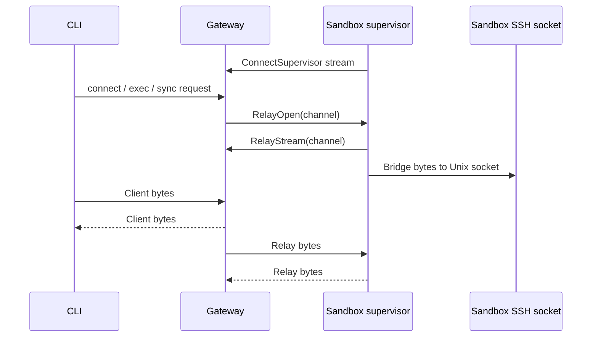

# Gateway

The gateway is the OpenShell control plane. It exposes the API used by the CLI,
SDK, and TUI; persists platform state; manages provider credentials and
inference configuration; and asks compute runtimes to create or delete sandbox
workloads.

## Responsibilities

- Authenticate clients and sandbox callbacks.
- Serve gRPC APIs for sandbox lifecycle, provider management, policy updates,
  settings, inference configuration, logs, and watch streams.
- Serve HTTP endpoints for health, SSH tunnel upgrades, and edge-auth flows.
- Persist domain objects in SQLite or Postgres.
- Resolve provider credentials and inference bundles for sandbox supervisors.
- Coordinate supervisor relay sessions for connect, exec, and file sync.

The gateway does not enforce agent network policy at request time. That happens
inside each sandbox, where the supervisor and proxy can observe local process
identity.

## Protocol and Auth

The gateway listens on one service port and multiplexes gRPC and HTTP traffic.
The default deployment mode is mTLS: clients and sandbox workloads present a
certificate signed by the deployment CA before reaching application handlers.

Supported auth modes:

| Mode | Use |
|---|---|
| mTLS | Default direct gateway access for CLI, SDK, TUI, and sandbox callbacks. |
| Plaintext | Local development or a trusted reverse proxy boundary. |
| Cloudflare JWT | Edge-authenticated deployments where Cloudflare Access supplies identity. |
| OIDC | Bearer-token auth for users, with browser PKCE or client credentials login. |

Sandbox supervisor RPCs authenticate with either mTLS material or a sandbox
secret depending on the runtime and deployment mode. User-facing mutations are
authorized by role policy when OIDC or edge identity is enabled.

## API Surface

The gateway API is organized around platform objects and operational streams:

| Area | Examples |
|---|---|
| Sandbox lifecycle | Create, list, delete, watch, exec, SSH session bootstrap. |
| Providers | Store provider records, discover credentials, resolve runtime environment. |
| Policy and settings | Get effective sandbox config, update sandbox policy, manage global settings. |
| Inference | Set gateway-level model/provider config and resolve sandbox route bundles. |
| Observability | Push sandbox logs, stream sandbox status and logs to clients. |

Domain objects use shared metadata: stable server-generated IDs, human-readable
names, creation timestamps, and labels. Crate-level details live in
`crates/openshell-core/README.md`.

## Persistence

The gateway persistence layer is a protobuf object store. Domain services store
typed protobuf messages as opaque binary payloads, while the database keeps a
small set of indexed metadata columns for lookup, listing, versioning, and
workflow state. The implementation lives in the
[gateway persistence module](../crates/openshell-server/src/persistence/mod.rs);
backend-specific SQL lives in the SQLite and Postgres migration directories
under `crates/openshell-server/migrations/`.

The storage schema is intentionally narrow:

| Column | Purpose |
|---|---|
| `id` | Stable gateway-generated object ID and primary key. |
| `object_type` | Logical resource kind, such as `sandbox`, `provider`, `ssh_session`, `inference_route`, `sandbox_policy`, or `draft_policy_chunk`. |
| `name` | Human-readable name, unique within an object type when present. |
| `scope` | Optional owner or namespace for scoped/versioned records, such as a sandbox ID for policy revisions. |
| `version` | Optional monotonically increasing version for scoped records. |
| `status` | Optional workflow state for records such as policy revisions or draft policy chunks. |
| `dedup_key` and `hit_count` | Optional policy-advisor fields for coalescing repeated observations. Draft policy chunks only set `dedup_key` while pending; the slot is released when the draft is approved or rejected so a later denial for the same destination can surface as a new pending draft. |
| `payload` | Prost-encoded protobuf payload for the full domain object. |
| `created_at_ms` and `updated_at_ms` | Gateway timestamps used for ordering and list output. |
| `labels` | JSON object carrying Kubernetes-style object labels for filtering and organization. |

Common resources use generic helpers that derive `object_type`, `id`, `name`,
and labels from protobuf metadata traits before encoding the full message into
`payload`. Policy revisions and draft policy chunks use the same table but also
populate `scope`, `version`, `status`, `dedup_key`, and `hit_count` so the
gateway can efficiently fetch the latest policy, track load status, and manage
advisor drafts without creating resource-specific tables.

SQLite is the default local store; Postgres is supported for deployments that
need an external database or multi-replica coordination. Both backends expose
the same `Store` API and the same logical schema. Backend differences stay
inside the adapters: for example, SQLite stores labels as JSON text and payloads
as `BLOB`, while Postgres stores labels as `JSONB` and payloads as `BYTEA`.
Domain code should depend on the object-store contract, not SQL dialect details.
This keeps the gateway data model portable across storage backends and leaves
room for future stores that can provide the same object, label, version, and
scope semantics.

Persisted state includes sandboxes, providers, SSH sessions, policy revisions,
settings, inference configuration, and deployment records.

Policy and runtime settings are delivered together through the effective sandbox
config path. A gateway-global policy can override sandbox-scoped policy. The
sandbox supervisor polls for config revisions and hot-reloads dynamic policy
when the policy engine accepts the update.

## Supervisor Relay

Sandbox workloads maintain an outbound supervisor session to the gateway. This
lets the gateway open per-request byte relays without requiring inbound network
access to the sandbox workload.

The same relay pattern backs interactive SSH, command execution, and file sync.
The gateway tracks live sessions in memory and persists session records so
tokens can expire or be revoked.

## PKI Bootstrap

`openshell-gateway generate-certs` is the one place mTLS materials are
created. Both deployment paths use it:

| Output mode | Selector | Layout |
|---|---|---|
| Kubernetes Secrets | (default) `--namespace`, `--server-secret-name`, `--client-secret-name` | Two `kubernetes.io/tls` Secrets with `tls.crt` / `tls.key` / `ca.crt`. |
| Filesystem | `--output-dir <DIR>` | `<dir>/{ca.crt, ca.key, server/tls.{crt,key}, client/tls.{crt,key}}`. Also copies client materials to `$XDG_CONFIG_HOME/openshell/gateways/openshell/mtls/` for CLI auto-discovery. |

On Kubernetes, the Helm chart runs the command via a pre-install/pre-upgrade
hook Job using the gateway image itself — no separate cert-generation image,
no extra mirror burden in air-gapped environments. On the RPM gateway, the
same command runs from the systemd unit's `ExecStartPre` to bootstrap PKI
into the user's state directory on first start.

Both modes share the same idempotency contract: all targets present → skip;
partial state → fail with a recovery hint; nothing present → generate and
write. This guards mTLS continuity across restarts and upgrades while still
recovering cleanly if an operator deletes everything and starts over.

Operators who manage PKI externally (cert-manager, an enterprise CA, or
pre-created Secrets) disable the Helm hook via `pkiInitJob.enabled=false`.
The chart also ships a `certManager.*` path that produces equivalent Secrets
through cert-manager `Issuer`/`Certificate` resources.

## Operational Constraints

- Gateway TLS and client certificate distribution are deployment concerns owned
  by the operator or packaging layer.
- Compute runtimes own the mechanics of starting workloads and injecting
  callback configuration.
- Gateway restarts recover persisted objects from storage, but live relay
  streams must be re-established by supervisors.
- User-facing behavior changes must update published docs in `docs/`; this file
  should only record stable architecture.
