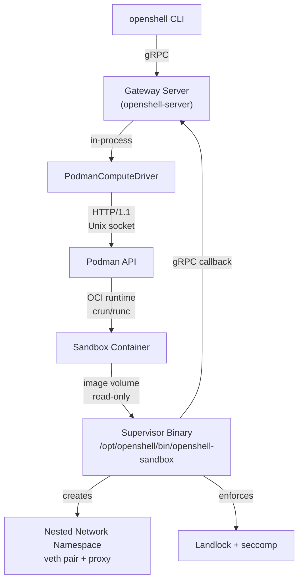
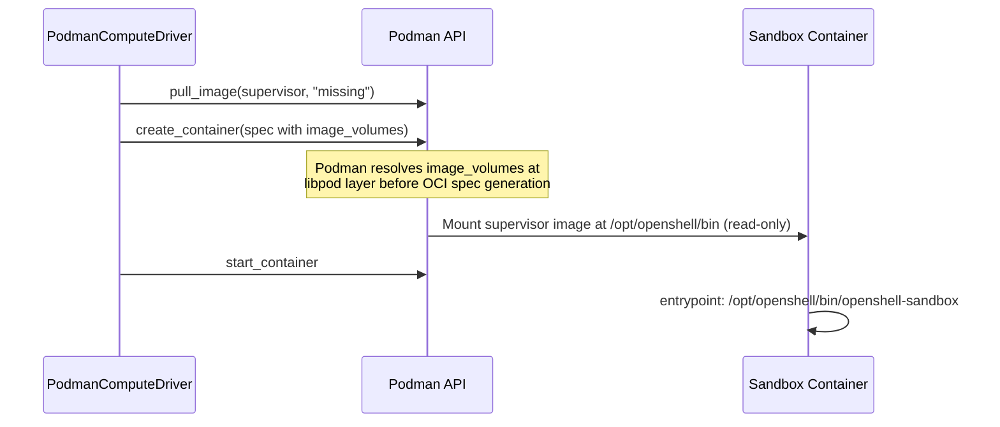
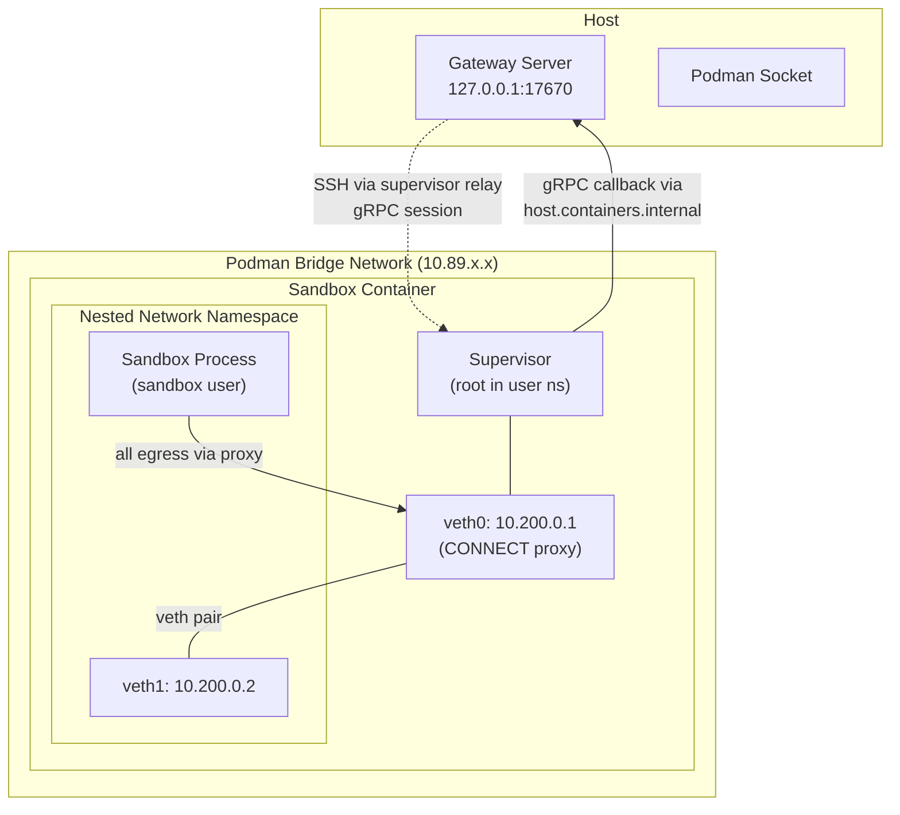
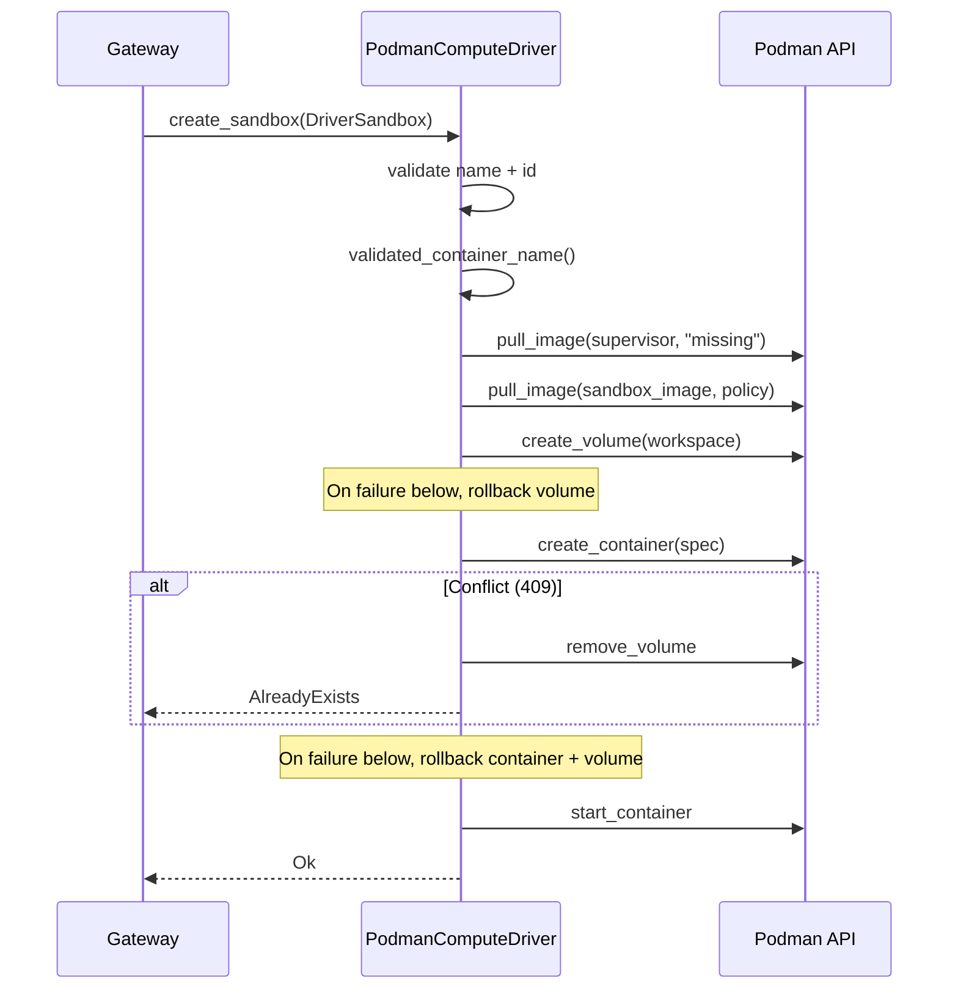

# openshell-driver-podman

The Podman compute driver manages sandbox containers via the Podman REST API
over a Unix socket. It targets single-machine and developer environments where
rootless container isolation is preferred over a full Kubernetes cluster. The
driver runs in-process within the gateway server and delegates all sandbox
isolation enforcement to the `openshell-sandbox` supervisor binary, which is
sideloaded into each container via an OCI image volume mount.

For a rootless networking deep dive, see [NETWORKING.md](NETWORKING.md).

## Architecture

The Podman driver communicates with the Podman daemon over a Unix socket and
delegates sandbox isolation to the supervisor binary running inside each
container.



## Isolation Model

The Podman driver provides the same protection layers as the other compute
drivers. The driver itself does not implement isolation primitives directly. It
configures the container so that the `openshell-sandbox` supervisor can enforce
them at runtime.

### Container Security Configuration

The container spec in `container.rs` sets these security-critical fields:

| Setting | Value | Rationale |
|---|---|---|
| `user` | `0:0` | The supervisor needs root inside the container for namespace creation, proxy setup, Landlock, seccomp, and filesystem preparation. |
| `cap_drop` | Selected unneeded defaults | Podman's default capability set is already restricted. The driver drops capabilities the supervisor does not need. |
| `cap_add` | `SYS_ADMIN`, `NET_ADMIN`, `SYS_PTRACE`, `SYSLOG`, `DAC_READ_SEARCH`, `SETPCAP` | Grants supervisor-only capabilities required for namespace setup, process identity, bypass diagnostics, and child bounding-set cleanup. |
| `no_new_privileges` | `true` | Prevents privilege escalation after exec. |
| `seccomp_profile_path` | `unconfined` | The supervisor installs its own policy-aware BPF filter. A container-level profile can block Landlock/seccomp syscalls during setup. |
| `mounts` | Private tmpfs at `/run/netns` | Lets the supervisor create named network namespaces in rootless Podman. |
| CDI GPU devices | Opaque `driver_config.cdi_devices` values when set, otherwise the requested count of NVIDIA CDI GPUs selected in round-robin order. Local `/dev/dxg` permits `nvidia.com/gpu=all` as a WSL2 all-only compatibility fallback, where it counts as one selectable device. | Exposes requested GPUs to GPU-enabled sandbox containers. Exact CDI device lists must not contain duplicates and must match the effective GPU count. |

The restricted agent child does not retain these supervisor privileges.

## Driver Config Mounts

The gateway forwards the `podman` block from `--driver-config-json` to this
driver. The driver accepts user-supplied `mounts` entries with these Podman
mount types:

- `bind`: mounts an absolute host path when `[openshell.drivers.podman]`
  has `enable_bind_mounts = true`.
- `volume`: mounts an existing Podman named volume. The driver validates that
  the volume exists before provisioning and never creates or removes it. Podman
  local-driver volumes created with bind options are treated as host bind
  mounts and require `enable_bind_mounts = true`.
- `tmpfs`: mounts an in-memory filesystem with optional `options`,
  `size_bytes`, and `mode`.
- `image`: mounts an OCI image through Podman's image-volume API. The driver
  pulls the image during provisioning using the sandbox image pull policy.

Host bind mounts are disabled by default because they expose gateway host paths
to sandbox requests. The driver still uses internal bind mounts for
OpenShell-owned token and TLS material.

Podman `bind` mounts accept `source`, `target`, and optional `read_only`.
User-supplied bind and volume mounts are read-only by default; set
`read_only: false` to make them writable. Podman image and volume mounts do not
support `subpath` in OpenShell driver config. Mount targets must be absolute
container paths and must not replace the workspace root (`/sandbox`) or overlap
OpenShell supervisor files, `/etc/openshell`, `/etc/openshell-tls`, or
`/run/netns`.

Example named-volume usage:

```shell
podman volume create openshell-work

openshell sandbox create \
  --driver-config-json '{"podman":{"mounts":[{"type":"volume","source":"openshell-work","target":"/sandbox/work"}]}}' \
  -- claude
```

### Capability Breakdown

| Capability | Purpose |
|---|---|
| `SYS_ADMIN` | seccomp filter installation, namespace creation, and Landlock setup. |
| `NET_ADMIN` | Network namespace veth setup, IP address assignment, routes, and nftables. |
| `SYS_PTRACE` | Reading `/proc/<pid>/exe` and walking process ancestry for binary identity. |
| `SYSLOG` | Reading `/dev/kmsg` for bypass-detection diagnostics. |
| `DAC_READ_SEARCH` | Reading `/proc/<pid>/fd/` across UIDs so the proxy can resolve the binary responsible for a connection. |
| `SETPCAP` | Clearing the restricted child process capability bounding set before exec. |

The driver intentionally keeps Podman's default `SETUID`, `SETGID`, `CHOWN`,
and `FOWNER` capabilities because the supervisor needs them to drop privileges
and prepare writable sandbox directories. It also keeps `SETPCAP` until child
setup so `drop_privileges()` can clear the child capability bounding set before
exec. It drops unneeded defaults such as
`DAC_OVERRIDE`, `FSETID`, `KILL`, `NET_BIND_SERVICE`, `NET_RAW`, `SETFCAP`,
and `SYS_CHROOT`.

## Supervisor Sideloading

The supervisor binary is delivered to sandbox containers via Podman's OCI image
volume mechanism, distinct from both the Kubernetes pod-volume approach and the
VM's embedded guest bundle.



The supervisor image from `deploy/docker/Dockerfile.supervisor` copies the static
`openshell-sandbox` binary to `/openshell-sandbox`.
Mounting that image at `/opt/openshell/bin` makes the binary available as
`/opt/openshell/bin/openshell-sandbox`.

The container spec sets that binary as the entrypoint. This avoids relying on
the sandbox image entrypoint or command, which might otherwise append the
supervisor path as an argument to an image-provided shell.

## TLS

When all three Podman TLS paths are set, the driver treats sandbox callbacks as
mTLS callbacks:

- `OPENSHELL_PODMAN_TLS_CA`
- `OPENSHELL_PODMAN_TLS_CERT`
- `OPENSHELL_PODMAN_TLS_KEY`

The driver validates that the TLS paths are provided as a complete set. Partial
configuration fails early instead of silently falling back to plaintext.

When enabled, the driver:

1. Switches the auto-detected endpoint scheme from `http://` to `https://`.
2. Bind-mounts the client cert files read-only into the container at
   `/etc/openshell/tls/client/`.
3. Sets `OPENSHELL_TLS_CA`, `OPENSHELL_TLS_CERT`, and `OPENSHELL_TLS_KEY` to
   the container-side paths.

The supervisor reads these env vars and uses them to establish an mTLS
connection back to the gateway. On SELinux systems, the bind mounts include
Podman's shared relabel option so the container process can read the files.

The RPM packaging auto-generates a self-signed PKI on first start via
`openshell-gateway generate-certs`. Client certs are placed in the CLI
auto-discovery directory (`~/.config/openshell/gateways/openshell/mtls/`) so
the CLI connects with mTLS without manual configuration. See
`deploy/rpm/CONFIGURATION.md` for the full RPM configuration reference.

## Network Model

Sandbox network isolation uses a two-layer approach: a Podman bridge network
for container-to-host communication, and a nested network namespace created by
the supervisor for sandbox process isolation.



Key points:

- Bridge network: created by `client.ensure_network()` with DNS enabled.
  Containers on the bridge can see each other at L3, but sandbox processes
  cannot because they are isolated inside the nested netns.
- Nested netns: the supervisor creates a private `NetworkNamespace` with a veth
  pair. Sandbox processes enter this netns via `setns(fd, CLONE_NEWNET)` in the
  `pre_exec` hook, forcing ordinary traffic through the CONNECT proxy.
- Port publishing: the container spec still requests `host_port: 0` for the
  configured SSH port. The gateway SSH tunnel uses the supervisor relay rather
  than connecting directly to the published port.
- Host gateway: `host.containers.internal` and `host.openshell.internal` are
  injected into `/etc/hosts` so containers can reach services on the gateway
  host. Linux defaults to Podman's `host-gateway` resolver. macOS Podman
  machine defaults to gvproxy's host-loopback IP, `192.168.127.254`, because
  stale Podman machines may fail to resolve `host-gateway`.
- nsenter: the supervisor uses `nsenter --net=` instead of `ip netns exec` for
  namespace operations, avoiding the sysfs remount path that fails in rootless
  containers.

See [NETWORKING.md](NETWORKING.md) for the rootless Podman networking deep dive.

## Supervisor Relay

Podman follows the same end-to-end contract as the Kubernetes and VM drivers
for the in-container SSH relay: gateway config to `PodmanComputeConfig` to
sandbox environment to supervisor session registration on that path.

1. `openshell-core` `Config::sandbox_ssh_socket_path` is copied into
   `PodmanComputeConfig::sandbox_ssh_socket_path` when the gateway builds the
   in-process driver.
2. `build_env()` in `container.rs` sets `OPENSHELL_SSH_SOCKET_PATH` to that
   value, alongside required vars such as `OPENSHELL_ENDPOINT` and
   `OPENSHELL_SANDBOX_ID`. These driver-controlled entries overwrite template
   environment variables to prevent spoofing.
3. The supervisor reads `OPENSHELL_SSH_SOCKET_PATH` and uses it for the Unix
   socket the gateway's SSH stack bridges to.

The standalone `openshell-driver-podman` binary sets the same struct field from
`OPENSHELL_SANDBOX_SSH_SOCKET_PATH`.

## Credential Injection

Sandboxes authenticate to the gateway via mTLS using client materials bind-
mounted into the container from a Podman secret. No shared per-request secret
is injected as an environment variable.

| Credential | Mechanism | Visible in `inspect`? | Visible in `/proc/<pid>/environ`? |
|---|---|---|---|
| mTLS client cert/key | Bind-mounted file paths (`OPENSHELL_TLS_*` env vars point at them) | Yes (paths only) | Yes (paths only) |
| Sandbox identity | Plaintext env var | Yes | Yes |
| gRPC endpoint | Plaintext env var, override-protected | Yes | Yes |
| Supervisor relay socket path | Plaintext env var, override-protected | Yes | Yes |

The `build_env()` function inserts user-supplied variables first, then
unconditionally overwrites all security-critical variables to prevent spoofing
via sandbox templates:

- `OPENSHELL_SANDBOX`
- `OPENSHELL_SANDBOX_ID`
- `OPENSHELL_ENDPOINT`
- `OPENSHELL_SSH_SOCKET_PATH`
- `OPENSHELL_CONTAINER_IMAGE`
- `OPENSHELL_SANDBOX_COMMAND`

## Sandbox Lifecycle

### Creation Flow



Each step rolls back previously-created resources on failure. The Conflict path
cleans up the volume because it is keyed by the new sandbox's ID, not the
conflicting container's ID.

### Readiness and Health

The container `healthconfig` marks the sandbox healthy when any of these
signals succeeds:

- Legacy marker file `/var/run/openshell-ssh-ready`.
- `test -S` on the configured supervisor Unix socket path.
- The prior TCP check for a listener on the in-container SSH port.

The Unix socket check allows relay-only readiness when the supervisor exposes
the socket without the old marker or published-port signal.

### Deletion Flow

1. Validate `sandbox_name` and stable `sandbox_id` from `DeleteSandboxRequest`.
2. Best-effort inspect cross-checks the container label when present, but
   cleanup remains keyed by the request `sandbox_id`.
3. Best-effort stop, ignoring the stop result.
4. Force-remove the container.
5. Remove workspace volume derived from the request `sandbox_id`, warning on
   failure and continuing.

If the container is already gone during inspect or remove, the driver still
performs idempotent volume cleanup using the request `sandbox_id` and
returns `Ok(false)` for the container-delete result. This prevents leaked
Podman resources after out-of-band container removal or label drift.

## Configuration

| Environment Variable | CLI Flag | Default | Description |
|---|---|---|---|
| `OPENSHELL_PODMAN_SOCKET` | `--podman-socket` | `$XDG_RUNTIME_DIR/podman/podman.sock` on Linux, `$HOME/.local/share/containers/podman/machine/podman.sock` on macOS | Podman API Unix socket path. |
| `OPENSHELL_SANDBOX_IMAGE` | `--sandbox-image` | From gateway config | Default OCI image for sandboxes. |
| `OPENSHELL_SANDBOX_IMAGE_PULL_POLICY` | `--sandbox-image-pull-policy` | `missing` | Pull policy: `always`, `missing`, `never`, or `newer`. |
| `OPENSHELL_GRPC_ENDPOINT` | `--grpc-endpoint` | Auto-detected via `host.containers.internal` | Gateway gRPC endpoint for sandbox callbacks. |
| `OPENSHELL_GATEWAY_PORT` | `--gateway-port` | `17670` | Gateway port used for endpoint auto-detection by the standalone binary. |
| `OPENSHELL_NETWORK_NAME` | `--network-name` | `openshell` | Podman bridge network name. |
| `OPENSHELL_PODMAN_HOST_GATEWAY_IP` | `--host-gateway-ip` | empty on Linux, `192.168.127.254` on macOS | Host gateway IP used for sandbox host aliases. Empty uses Podman's `host-gateway` resolver. |
| `OPENSHELL_SANDBOX_SSH_SOCKET_PATH` | `--sandbox-ssh-socket-path` | `/run/openshell/ssh.sock` | Supervisor Unix socket path in `PodmanComputeConfig`. |
| `OPENSHELL_STOP_TIMEOUT` | `--stop-timeout` | `10` | Container stop timeout in seconds. |
| `OPENSHELL_SANDBOX_PIDS_LIMIT` | `--sandbox-pids-limit` | `2048` | Podman cgroup PID limit for sandbox containers. Set `0` to inherit Podman's runtime/default PID limit. |
| `OPENSHELL_SUPERVISOR_IMAGE` | `--supervisor-image` | `ghcr.io/nvidia/openshell/supervisor:latest` through the gateway, required standalone | OCI image containing the supervisor binary. |
| `OPENSHELL_PODMAN_TLS_CA` | `--podman-tls-ca` | unset | Host path to the CA certificate mounted for sandbox mTLS. |
| `OPENSHELL_PODMAN_TLS_CERT` | `--podman-tls-cert` | unset | Host path to the client certificate mounted for sandbox mTLS. |
| `OPENSHELL_PODMAN_TLS_KEY` | `--podman-tls-key` | unset | Host path to the client private key mounted for sandbox mTLS. |

## Rootless-Specific Adaptations

The Podman driver is designed for rootless operation. The following adaptations
matter compared to cluster or rootful runtimes:

1. subuid/subgid preflight check: on non-macOS hosts, `check_subuid_range()` in
   `driver.rs` warns operators if `/etc/subuid` or `/etc/subgid` entries are
   missing for the current user. This is not a hard error because some systems
   use LDAP or other mechanisms. macOS skips the check because `podman machine`
   runs the Podman service inside a Linux VM.
2. cgroups v2 requirement: the driver refuses to start if cgroups v1 is
   detected. Rootless Podman requires the unified cgroup hierarchy.
3. `nsenter` for namespace operations: `openshell-sandbox` uses
   `nsenter --net=` instead of `ip netns exec` to avoid the sysfs remount path
   that requires real `CAP_SYS_ADMIN` in the host user namespace.
4. `DAC_READ_SEARCH` capability: required for the proxy to read
   `/proc/<pid>/fd/` across UIDs within the user namespace.
5. `SETUID` and `SETGID` capabilities: kept from Podman's default capability
   set so `drop_privileges()` can call `setuid()` and `setgid()`.
6. `host.containers.internal`: used instead of Docker's `host.docker.internal`
   for container-to-host communication. The driver also injects the
   OpenShell-owned `host.openshell.internal` alias.
7. Ephemeral port publishing: the SSH compatibility port uses `host_port: 0`
   because the bridge network IP is not reliably routable from the host in
   rootless mode.
8. tmpfs at `/run/netns`: a private tmpfs lets the supervisor create named
   network namespaces via `ip netns add`.

## Implementation References

- Gateway integration: `crates/openshell-server/src/compute/mod.rs`
  (`new_podman` and `PodmanComputeDriver` wiring).
- Server configuration: `crates/openshell-server/src/lib.rs`
  (`ComputeDriverKind::Podman` builds `PodmanComputeConfig` including
  `sandbox_ssh_socket_path` from gateway `Config`).
- Gateway relay path: `openshell-core` `Config::sandbox_ssh_socket_path` in
  `crates/openshell-core/src/config.rs`.
- SSRF mitigation: `crates/openshell-core/src/net.rs`,
  `crates/openshell-sandbox/src/proxy.rs`, and
  `crates/openshell-server/src/grpc/policy.rs`.
- Sandbox supervisor: `crates/openshell-sandbox/src/` for Landlock, seccomp,
  netns, proxy, and relay behavior shared by all drivers.
- Container engine abstraction: `tasks/scripts/container-engine.sh` for
  build/deploy support across Docker and Podman.
- Supervisor image build: `deploy/docker/Dockerfile.supervisor`.
