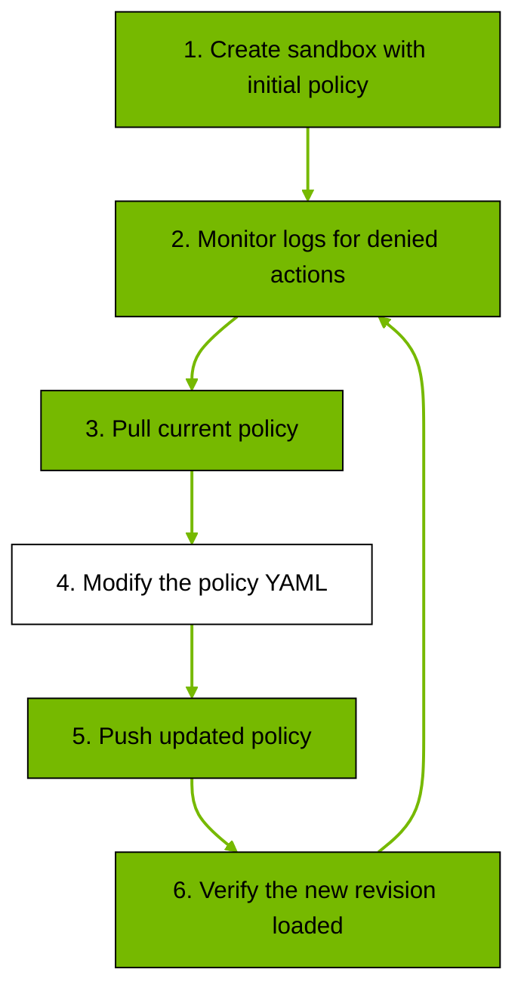

Use this page to apply and iterate policy changes on running sandboxes. For a full field-by-field YAML definition, use the [Policy Schema Reference](/reference/policy-schema).

## Policy Structure

A policy has static sections `filesystem_policy`, `landlock`, and `process` that are locked at sandbox creation, and dynamic `network_policies` and `network_middlewares` sections that are hot-reloadable on a running sandbox.

```yaml wordWrap showLineNumbers={false}
version: 1

# Static: locked at sandbox creation. Paths the agent can read vs read/write.
filesystem_policy:
  read_only: [/usr, /lib, /etc]
  read_write: [/sandbox, /tmp]

# Static: Landlock LSM kernel enforcement. best_effort uses highest ABI the host supports.
landlock:
  compatibility: best_effort

# Static: Unprivileged user/group the agent process runs as.
process:
  run_as_user: sandbox
  run_as_group: sandbox

# Dynamic: hot-reloadable. Named blocks of endpoints + binaries allowed to reach them.
network_policies:
  my_api:
    name: my-api
    endpoints:
      - host: api.example.com
        port: 443
        protocol: rest
        enforcement: enforce
        access: full
    binaries:
      - path: /usr/bin/curl

# Dynamic: ordered middleware selected independently by admitted host.
network_middlewares:
  - name: redact-secrets
    middleware: openshell/secrets
    config:
      secrets: redact
    on_error: fail_closed
    endpoints:
      include: ["api.example.com"]
      exclude: []

```

Static sections are locked at sandbox creation. Changing them requires destroying and recreating the sandbox.
Dynamic sections can be updated on a running sandbox with `openshell policy update` for incremental merges or `openshell policy set` for full replacement, and take effect without restarting.
When a hot reload changes rules on an active HTTP L7 endpoint, existing keep-alive tunnels are closed before forwarding another parsed request. Credential-injection-only HTTP passthrough tunnels use the same reload boundary. Most HTTP clients reconnect automatically, and the next request is evaluated against the current policy.
Raw streams are connection-scoped and outside L7 live-reload guarantees. This includes `tls: skip`, non-HTTP TCP payloads, HTTP upgrades such as WebSocket, and long-lived response streams such as SSE. A reload applies to the next connection or next parsed HTTP request; it does not interrupt an already-forwarded raw stream. Use `protocol: websocket` when policy should stay attached to the RFC 6455 upgrade and client text messages after the allowed upgrade. Add `websocket_credential_rewrite: true` only when the relay should rewrite credential placeholders in client-to-server WebSocket text messages. Add `request_body_credential_rewrite: true` only on inspected REST endpoints that need OpenShell to rewrite placeholders in supported text request bodies.

| Section | Type | Description |
|---|---|---|
| `filesystem_policy` | Static | Controls which directories the agent can access on disk. Paths are split into `read_only` and `read_write` lists. Any path not listed in either list is inaccessible. Set `include_workdir: true` to automatically add the agent's working directory to `read_write`. [Landlock LSM](https://docs.kernel.org/security/landlock.html) enforces these restrictions at the kernel level. |
| `landlock` | Static | Configures Landlock LSM enforcement behavior. Set `compatibility` to `best_effort` (skip individual inaccessible paths while applying remaining rules) or `hard_requirement` (fail if any path is inaccessible or the required kernel ABI is unavailable). Refer to the [Policy Schema Reference](/reference/policy-schema#landlock) for the full behavior table. |
| `process` | Static | Sets the OS-level identity for the agent process. `run_as_user` and `run_as_group` default to `sandbox`. Root (`root` or `0`) is rejected. The agent also runs with seccomp filters that block dangerous system calls. |
| `network_policies` | Dynamic | Controls network access for ordinary outbound traffic from the sandbox. Each block has a name, a list of endpoints (host, port, protocol, and optional rules), and a list of binaries allowed to use those endpoints. <br />Every outbound connection except `https://inference.local` goes through the proxy, which queries the [policy engine](/about/how-it-works#core-components) with the destination and calling binary. A connection is allowed only when both match an entry in the same policy block. <br />For endpoints with `protocol: rest`, the proxy auto-detects TLS and terminates it so each HTTP request can be checked against that endpoint's `rules` (method and path). For endpoints with `protocol: websocket`, the proxy validates the RFC 6455 upgrade and evaluates `GET` rules for the handshake plus either `WEBSOCKET_TEXT` rules for raw client text messages or GraphQL operation rules for GraphQL-over-WebSocket messages. Set `websocket_credential_rewrite: true` only when a WebSocket or REST compatibility endpoint must keep placeholder credentials in sandbox-owned text frames and resolve them at the OpenShell relay boundary. <br />Endpoints without `protocol` allow the TCP stream through without inspecting payloads. <br />If no endpoint matches, the connection is denied. Configure managed inference separately through [Inference Routing](/sandboxes/inference-routing). |
| `network_middlewares` | Dynamic | Declares ordered HTTP request middleware configs. After network and L7 policy admit a request, OpenShell matches each config's host selectors independently and runs matching entries in declaration order before credential injection. |

## Supervisor Middleware

Supervisor middleware can inspect, deny, or replace admitted HTTP request bodies before provider credentials are injected. Middleware selection is independent of the `network_policies` rule that admitted the request: each `network_middlewares` entry matches the destination host through `endpoints.include` and `endpoints.exclude`.

```yaml
network_middlewares:
  - name: redact-secrets
    middleware: openshell/secrets
    config:
      secrets: redact
    on_error: fail_closed
    endpoints:
      include: ["*.example.com"]
      exclude: ["trusted.example.com"]
```

Matching entries run once each in top-level declaration order. Config names must be unique. Different config names may use the same implementation and run as distinct stages. `exclude` takes precedence over `include`.

`openshell/secrets` is built into the supervisor. External binding IDs must be registered by the gateway operator before a policy can reference them; see [External Supervisor Middleware](/reference/gateway-config#external-supervisor-middleware). The gateway calls the implementation's `ValidateConfig` before accepting the policy.

`on_error` defaults to `fail_closed`. Use `fail_open` only when skipping a failed middleware is acceptable. Middleware applies only to HTTP traffic the supervisor can parse and inspect; policy validation rejects a required selector that can cover a `tls: skip` endpoint.

## Baseline Filesystem Paths

When a sandbox runs in proxy mode (the default), OpenShell automatically adds baseline filesystem paths required for the sandbox child process to function: `/usr`, `/lib`, `/etc`, `/var/log` (read-only) and `/sandbox`, `/tmp` (read-write). Paths like `/app` are included in the baseline set but are only added if they exist in the container image.

For GPU sandboxes, OpenShell also adds existing GPU device nodes as read-write paths. CUDA workloads require write access to procfs for thread metadata, so GPU baseline enrichment moves `/proc` from read-only to read-write when GPU devices are present.

This filtering prevents a missing baseline path from degrading Landlock enforcement. Without it, a single missing path could cause the entire Landlock ruleset to fail, leaving the sandbox with no filesystem restrictions at all.

User-specified paths in your policy YAML are not pre-filtered. If you list a path that does not exist:

- In `best_effort` mode, the path is skipped with a warning and remaining rules are still applied.
- In `hard_requirement` mode, sandbox startup fails immediately.

This distinction means baseline system paths degrade gracefully while user-specified paths surface configuration errors.

## Apply a Custom Policy

Pass a policy YAML file when creating the sandbox:

```shell
openshell sandbox create --policy ./my-policy.yaml -- claude
```

`openshell sandbox create` keeps the sandbox running after the initial command exits, which is useful when you plan to iterate on the policy. Add `--no-keep` if you want the sandbox deleted automatically instead.

To avoid passing `--policy` every time, set a default policy with an environment variable:

```shell
export OPENSHELL_SANDBOX_POLICY=./my-policy.yaml
openshell sandbox create -- claude
```

The CLI uses the policy from `OPENSHELL_SANDBOX_POLICY` whenever `--policy` is not explicitly provided.

## Iterate on a Running Sandbox

To change what the sandbox can access, pull the current policy, edit the YAML, and push the update. The workflow is iterative: create the sandbox, monitor logs for denied actions, pull the policy, modify it, push, and verify.



The following steps outline the hot-reload policy update workflow.

1. Create the sandbox with your initial policy by following [Apply a Custom Policy](#apply-a-custom-policy) above (or set `OPENSHELL_SANDBOX_POLICY`).

2. Monitor denials. Each log entry shows host, port, binary, and reason. Alternatively, use `openshell term` for a live dashboard.

   ```shell
   openshell logs <name> --tail --source sandbox
   ```

3. For additive network changes, use `openshell policy update`. This is the fastest path for adding endpoints, binaries, or REST and WebSocket allow/deny rules without replacing the full policy. The full option and format reference is in [Incremental Policy Updates](#incremental-policy-updates).

   ```shell
   openshell policy update <name> \
     --add-endpoint api.github.com:443:read-only:rest:enforce \
     --binary /usr/bin/gh \
     --wait

   openshell policy update <name> \
     --add-allow 'api.github.com:443:POST:/repos/*/issues' \
     --wait
   ```

   `--add-allow` and `--add-deny` target existing `protocol: rest` or `protocol: websocket` endpoints. If you pass multiple update flags in one command, OpenShell applies them as one atomic merge batch and persists at most one new revision.

4. For larger edits, pull the current base policy and edit the YAML directly. The base policy is the user-authored policy without provider-composed `_provider_*` entries, so it is safe to round-trip through `openshell policy set`. Before reusing the file, strip the metadata header above the `---` line.

   ```shell
   openshell policy get <name> --base > current-policy.yaml
   ```

   To inspect the effective policy that the sandbox enforces, including provider-composed entries, use `openshell policy get <name> --full`. To inspect a stored sandbox-authored revision instead of the current effective policy, pass `--rev <version>`.

5. Edit the YAML: add or adjust `network_policies` entries, binaries, `access`, `rules`, or protocol-specific matchers such as GraphQL operation fields, MCP `method` / `tool` rules, and generic JSON-RPC `method` rules.

6. Push the updated policy when you need a full replacement. Exit codes: 0 = loaded, 1 = validation failed, 124 = timeout.

   ```shell
   openshell policy set <name> --policy current-policy.yaml --wait
   ```

7. Verify the new revision. If status is `loaded`, repeat from step 2 as needed; if `failed`, fix the policy and repeat from step 4.

   ```shell
   openshell policy list <name>
   ```

## Incremental Policy Updates

Use `openshell policy update` when you want to merge network policy changes into the current live policy instead of replacing the whole YAML document. This command only updates the dynamic `network_policies` section.

`openshell policy update` is useful when you want to:

- add a new endpoint for an existing binary without touching other policy sections.
- add a few REST or WebSocket allow/deny rules after you see a blocked request in the logs.
- remove one endpoint or one named rule without rewriting the rest of the file.
- preview a merged result locally with `--dry-run` before you send it to the gateway.

Use `openshell policy set` instead when you want to replace the full policy, update static sections, or make broader edits that are easier to express in YAML. Use full YAML for GraphQL, MCP, and JSON-RPC rule shapes.

### Update Commands

The incremental update surface is split into endpoint-level operations and method/path rule-level operations for REST and WebSocket endpoints.

| Flag | What it changes | Typical use |
|---|---|---|
| `--add-endpoint <SPEC>` | Creates or merges a network rule and endpoint. | Allow a new host and port, optionally with `access`, `protocol`, `enforcement`, endpoint options, and binaries. |
| `--remove-endpoint <SPEC>` | Removes one host and port match from the current policy. | Drop a stale endpoint or remove one port from a multi-port endpoint. |
| `--remove-rule <NAME>` | Deletes a named `network_policies` entry. | Remove a whole rule by name when you no longer need it. |
| `--add-allow <SPEC>` | Appends method/path allow rules to an existing REST or WebSocket endpoint. | Permit one additional REST method/path or WebSocket `WEBSOCKET_TEXT` path on an API that is already configured. |
| `--add-deny <SPEC>` | Appends method/path deny rules to an existing REST or WebSocket endpoint. | Block a sensitive REST path or WebSocket text-message path under an endpoint that is otherwise allowed. |
| `--binary <PATH>` | Adds binaries to every `--add-endpoint` rule in the same command. | Bind a new endpoint to one or more executables. |
| `--rule-name <NAME>` | Overrides the generated rule name. | Keep a stable human-chosen rule name when adding exactly one endpoint. |
| `--dry-run` | Shows the merged policy locally and does not call the gateway. | Review the result before persisting it. |
| `--wait` | Polls until the sandbox reports that the new revision loaded. | Confirm the change took effect before continuing. |
| `--timeout <SECS>` | Sets the timeout for `--wait`. | Extend the wait window for slower sandboxes. |

`--wait` and `--dry-run` cannot be used together.

### Add Endpoint Compared to Allow and Deny

`--add-endpoint` works at the endpoint and rule level. It creates a new `network_policies` entry when needed, or merges into an existing rule that already covers the same host and port. Use it when you define where traffic can go and which binaries can send it.

`--add-allow` and `--add-deny` work at the method/path rule level. They do not create binaries, and they do not create a new endpoint. They modify an existing endpoint that already has `protocol: rest` or `protocol: websocket`.

This is the practical difference:

- Use `--add-endpoint` to say "allow this binary to reach `api.github.com:443`."
- Use `--add-allow` to say "for that existing REST endpoint, also allow `POST /repos/*/issues`."
- Use `--add-deny` to say "for that existing REST endpoint, explicitly deny `POST /admin/**`."
- Use `--add-allow` to say "for that existing WebSocket endpoint, also allow client text messages on `/v1/realtime/**`."

Current constraints:

- `--add-allow` and `--add-deny` work on `protocol: rest` and `protocol: websocket` endpoints.
- GraphQL, MCP, and JSON-RPC fine-grained rules require full policy YAML applied with `openshell policy set`.
- `--add-deny` requires the endpoint to already have an allow base, either an `access` preset or explicit allow `rules`.
- `protocol: sql` is not a practical incremental workflow today. OpenShell does not do full SQL parsing, and SQL enforcement is not meaningfully supported yet.

### Endpoint Specs

`--add-endpoint` uses this format:

```text
host:port[:access[:protocol[:enforcement[:options]]]]
```

Each segment has a fixed meaning:

| Segment | Required | Meaning |
|---|---|---|
| `host` | Yes | Destination hostname. |
| `port` | Yes | Destination port, `1` through `65535`. |
| `access` | No | Access preset for L7 endpoints: `read-only`, `read-write`, or `full`. Incremental updates expand presets into protocol-specific method/path rules for REST and WebSocket endpoints. |
| `protocol` | No | L7 inspection mode accepted by `openshell policy update`: `rest`, `websocket`, or `sql`. `sql` is audit-only and not a recommended workflow today. Full policy YAML also supports `graphql`, `mcp`, and `json-rpc`. |
| `enforcement` | No | Enforcement mode for inspected traffic: `enforce` or `audit`. |
| `options` | No | Comma-separated endpoint options. Use `websocket-credential-rewrite` with `protocol: websocket` or REST compatibility endpoints that perform a WebSocket upgrade. Use `request-body-credential-rewrite` only with `protocol: rest`. |

Examples:

| Example | Meaning |
|---|---|
| `pypi.org:443` | Add a plain L4 endpoint. The proxy allows the TCP stream and does not inspect HTTP requests. |
| `api.github.com:443:read-only:rest:enforce` | Add a REST endpoint with the `read-only` preset expanded by the policy engine into GET, HEAD, and OPTIONS access. |
| `api.example.com:443:read-write:rest:enforce:request-body-credential-rewrite` | Add a REST endpoint that rewrites credential placeholders in supported text request bodies. |
| `realtime.example.com:443:read-write:websocket:enforce` | Add a WebSocket endpoint with the `read-write` preset expanded by the policy engine into the upgrade `GET` and client `WEBSOCKET_TEXT` access. |
| `realtime.example.com:443:read-write:websocket:enforce:websocket-credential-rewrite` | Add a WebSocket endpoint that rewrites `openshell:resolve:env:*` placeholders in client text frames after an allowed upgrade. |

If you set `protocol: rest` or `protocol: websocket`, you also need an allow shape. With incremental updates, that means you should provide an `access` preset on `--add-endpoint`, then use `--add-allow` or `--add-deny` to refine method/path rules later.

Use the `websocket-credential-rewrite` endpoint option with `protocol: websocket` when the sandbox should send credential placeholders in client text frames and have OpenShell resolve them after the allowed upgrade. The option can also be used with `protocol: rest` compatibility endpoints that perform a WebSocket upgrade. It is rejected for plain L4 or `protocol: sql` endpoints.

Use the `request-body-credential-rewrite` endpoint option with `protocol: rest` when an API expects OpenShell-managed credentials in UTF-8 JSON, form, or text request bodies. OpenShell buffers up to 256 KiB, rewrites recognized credential placeholders, updates `Content-Length`, and rejects unresolved placeholders instead of forwarding them. The option is rejected for WebSocket, GraphQL, SQL, and plain L4 endpoints.

Credential rewrite recognizes the canonical `openshell:resolve:env:KEY` placeholder form and whole-token provider-shaped aliases such as `provider-OPENSHELL-RESOLVE-ENV-API_TOKEN` when the referenced environment key exists in the configured provider credentials.

For example:

- `api.github.com:443:read-only:rest` is valid.
- `realtime.example.com:443:read-write:websocket` is valid.
- `api.github.com:443::rest` is invalid. It does not mean "allow all traffic." An L7 endpoint with `protocol` but no `access` or `rules` is rejected when the policy loads.

Endpoint options belong to the individual `--add-endpoint` spec. When you pass multiple `--add-endpoint` flags in one command, every `--binary` value applies to every added endpoint in that command. If different endpoints need different binaries, use separate `policy update` commands.

If you do not pass `--rule-name`, OpenShell generates one from the host and port, such as `allow_api_github_com_443`.

### Method/Path Rule Specs

`--add-allow` and `--add-deny` use this format:

```text
host:port:METHOD:path_glob
```

This string identifies an existing REST or WebSocket endpoint and the request pattern you want to add.

In shell commands, quote the full `SPEC` when it contains `*` or `**` so your shell passes it literally instead of expanding it as a local file glob.

| Segment | Meaning |
|---|---|
| `host` | Existing endpoint host. |
| `port` | Existing endpoint port. |
| `METHOD` | HTTP method for REST endpoints, or `GET` / `WEBSOCKET_TEXT` for WebSocket endpoints. The CLI normalizes it to uppercase. |
| `path_glob` | URL path glob. For WebSocket text messages, this still matches the upgraded request path, not message payload content. It must start with `/`, or be `**`, or start with `**/`. |

This example:

```text
api.github.com:443:POST:/repos/*/issues
```

means:

- match the endpoint `api.github.com:443`.
- match HTTP method `POST`.
- match paths like `/repos/acme/issues`.
- do not match deeper paths like `/repos/acme/project/issues/123` because `*` matches one path segment.

Path globs follow the same semantics as YAML allow and deny rules:

- `*` matches one path segment.
- `**` matches any number of segments.
- `/repos/*/issues` matches one repository owner or name segment in the middle.
- `/repos/**` matches everything under `/repos/`.

The rule-level commands only modify method and path constraints. They do not change binaries, hostnames, ports, protocol settings, or WebSocket message payload matching.

### Common Workflows

Use these patterns as starting points when you decide whether to update an endpoint or append REST/WebSocket rules.

#### Add a new L4 endpoint

Use `--add-endpoint` when you need a new host and port and do not need REST inspection.

```shell
openshell policy update demo \
  --add-endpoint pypi.org:443 \
  --add-endpoint files.pythonhosted.org:443 \
  --binary /usr/bin/pip \
  --binary /usr/local/bin/uv \
  --wait
```

This creates or merges endpoint entries and binds them to the listed binaries. It does not create inspected method/path rules.

#### Create a REST endpoint with a base allow set

Use `--add-endpoint` first when the endpoint does not exist yet.

```shell
openshell policy update demo \
  --add-endpoint api.github.com:443:read-only:rest:enforce \
  --binary /usr/bin/gh \
  --wait
```

This creates a REST endpoint and sets its base allow behavior through the `read-only` access preset.

#### Add one more REST allow rule

Use `--add-allow` after the REST endpoint already exists.

```shell
openshell policy update demo \
  --add-allow 'api.github.com:443:POST:/repos/*/issues' \
  --wait
```

This keeps the existing endpoint definition and appends one new allow rule. It does not add binaries or change the endpoint host and port.

#### Add a REST deny rule under an allowed endpoint

Use `--add-deny` when you want to carve out a blocked subtree under an existing REST endpoint.

```shell
openshell policy update demo \
  --add-deny 'api.github.com:443:POST:/admin/**' \
  --wait
```

This adds a deny rule to the existing REST endpoint. The endpoint must already have an allow base.

#### Create a WebSocket endpoint with a base allow set

Use `--add-endpoint` with `protocol: websocket` when the destination is an RFC 6455 WebSocket API.

```shell
openshell policy update demo \
  --add-endpoint realtime.example.com:443:read-write:websocket:enforce:websocket-credential-rewrite \
  --binary /usr/bin/node \
  --wait
```

This creates a WebSocket endpoint and sets its base allow behavior through the `read-write` access preset. For WebSocket endpoints, `read-write` expands to the upgrade `GET` and client `WEBSOCKET_TEXT` messages on the upgraded request path. The rewrite option lets the sandbox send `openshell:resolve:env:*` placeholders in client text frames; OpenShell resolves them before forwarding to the upstream service.

#### Add a WebSocket text-message deny rule

Use `WEBSOCKET_TEXT` when you want to refine client-to-server text-frame policy without matching message payload content.

```shell
openshell policy update demo \
  --add-deny 'realtime.example.com:443:WEBSOCKET_TEXT:/v1/admin/**' \
  --wait
```

This adds a deny rule to the existing WebSocket endpoint. The path glob matches the WebSocket upgrade path.

#### Remove one endpoint or rule

Use `--remove-endpoint` to remove one host and port pair, or `--remove-rule` to delete the whole named rule.

```shell
openshell policy update demo --remove-endpoint pypi.org:443 --wait
openshell policy update demo --remove-rule github_repos --wait
```

If the target endpoint is part of a multi-port endpoint, `--remove-endpoint` removes only the specified port and keeps the rest.

### Merge Semantics

OpenShell applies all update flags from one `openshell policy update` command as one merge batch. The gateway validates the full merged result and persists at most one new policy revision.

This means:

- one command is atomic at the revision level.
- multiple flags in one command succeed or fail together.
- concurrent writers do not partially interleave one batch with another.

When two updates race, the gateway uses optimistic retry. It fetches the latest revision, reapplies the full batch, validates the result again, and retries the write. This preserves the intent of each individual command while still allowing concurrent sandbox policy updates.

### Preview and Validation

Use `--dry-run` when you want to inspect the merged YAML before you send it to the gateway.

```shell
openshell policy update demo \
  --add-allow 'api.github.com:443:GET:/repos/**' \
  --dry-run
```

The CLI validates the argument shapes before it sends the request. The gateway then validates the merged policy against the current live policy and returns clear errors when:

- a required segment is missing.
- a port is outside `1` through `65535`.
- `--add-allow` or `--add-deny` points at an endpoint that does not exist.
- `--add-allow` or `--add-deny` targets an endpoint that is neither REST nor WebSocket.
- `--add-deny` targets an endpoint that has no base allow set.

## Global Policy Override

Use a global policy when you want one policy payload to apply to every sandbox.

```shell
openshell policy set --global --policy ./global-policy.yaml
```

When a global policy is configured:

- The global payload is applied in full for all sandboxes.
- Sandbox-level policy updates are rejected until the global policy is removed.

To restore sandbox-level policy control, delete the global policy setting:

```shell
openshell policy delete --global
```

You can inspect a sandbox's effective settings and policy source with:

```shell
openshell settings get <name>
```

## Debug Denied Requests

Check `openshell logs <name> --tail --source sandbox` for the denied host, path, and binary.

For agent-authored draft updates on running sandboxes, enable [Policy Advisor](/sandboxes/policy-advisor). Policy advisor lets the sandboxed agent submit a narrow proposal through `policy.local` while a developer still approves or rejects the structured rule from outside the sandbox.

When triaging denied requests, check:

- Destination host and port to confirm which endpoint is missing.
- Calling binary path to confirm which `binaries` entry needs to be added or adjusted.
- HTTP method and path for REST endpoints, or `GET` / `WEBSOCKET_TEXT` and the upgraded request path for WebSocket endpoints, to confirm which `rules` entry needs to be added or adjusted.

Then push the updated policy as described above.

For small changes, prefer `openshell policy update` over rewriting the full YAML:

```shell
openshell policy update <name> --add-allow 'api.github.com:443:GET:/repos/**' --wait
```

## Examples

Add these blocks to the `network_policies` section of your sandbox policy. Apply simple endpoints and REST/WebSocket rule additions with `openshell policy update`, or apply any complete YAML block with `openshell policy set <name> --policy <file> --wait`.
Use **Simple endpoint** for host-level allowlists and **Granular rules** for method/path control.

<Tabs>
<Tab title="Simple endpoint">
Allow `pip install` and `uv pip install` to reach PyPI:

```yaml showLineNumbers={false}
  pypi:
    name: pypi
    endpoints:
      - host: pypi.org
        port: 443
      - host: files.pythonhosted.org
        port: 443
    binaries:
      - { path: /usr/bin/pip }
      - { path: /usr/local/bin/uv }
```

Endpoints without `protocol` use TCP passthrough, where the proxy allows the stream without inspecting payloads. If the stream is HTTP and TLS is auto-terminated, the proxy can still rewrite configured credential placeholders and closes keep-alive passthrough tunnels on policy reload before forwarding another request. WebSocket text-frame policy requires an explicit `protocol: websocket` endpoint. WebSocket payload credential rewrite can also be enabled on a `protocol: rest` compatibility endpoint with `websocket_credential_rewrite: true`. REST request body credential rewrite requires an inspected `protocol: rest` endpoint with `request_body_credential_rewrite: true`.
</Tab>

<Tab title="Granular rules">
Allow Claude and the GitHub CLI to reach `api.github.com` with separate REST and GraphQL endpoint scopes: read-only REST for general API paths, GraphQL operation inspection on `/graphql`, full REST write access for `alpha-repo`, and create/edit issues only for `bravo-repo`. Replace `<org_name>` with your GitHub org or username.

<Tip>
For an end-to-end walkthrough that combines this policy with a GitHub credential provider and sandbox creation, refer to [GitHub Sandbox](/get-started/tutorials/github-sandbox).

</Tip>

```yaml showLineNumbers={false}
  github_repos:
    name: github_repos
    endpoints:
      - host: api.github.com
        port: 443
        path: "/**"
        protocol: rest
        enforcement: enforce
        rules:
          - allow:
              method: GET
              path: "/**"
          - allow:
              method: HEAD
              path: "/**"
          - allow:
              method: OPTIONS
              path: "/**"
          - allow:
              method: "*"
              path: "/repos/<org_name>/alpha-repo/**"
          - allow:
              method: POST
              path: "/repos/<org_name>/bravo-repo/issues"
          - allow:
              method: PATCH
              path: "/repos/<org_name>/bravo-repo/issues/*"
      - host: api.github.com
        port: 443
        path: "/graphql"
        protocol: graphql
        enforcement: enforce
        rules:
          - allow:
              operation_type: query
          - allow:
              operation_type: mutation
              fields: [createIssue, updateIssue, addComment]
        deny_rules:
          - operation_type: mutation
            fields: [deleteRepository, deleteRef, updateBranchProtectionRule]
    binaries:
      - { path: /usr/local/bin/claude }
      - { path: /usr/bin/gh }
```

Endpoints with `protocol: rest` enable HTTP request inspection and can opt in to supported text request body credential rewrite. Endpoints with `protocol: websocket` validate WebSocket upgrades and inspect client text messages on the upgraded request path. WebSocket endpoints can also classify GraphQL-over-WebSocket operation messages with the same operation rules used by GraphQL-over-HTTP. Endpoints with `protocol: graphql` parse GraphQL-over-HTTP payloads before evaluating rules. Endpoints with `protocol: mcp` parse MCP Streamable HTTP request bodies and evaluate `method`, optional `tool`, and supported params rules. Endpoints with `protocol: json-rpc` parse JSON-RPC-over-HTTP request bodies and evaluate `method` rules. The endpoint-level `path` field lets these protocols share `api.github.com:443` without treating GraphQL payloads as plain REST `POST /graphql` requests.
</Tab>

</Tabs>

### Query parameter matching

REST rules can also constrain query parameter values:

```yaml showLineNumbers={false}
  download_api:
    name: download_api
    endpoints:
      - host: api.example.com
        port: 443
        protocol: rest
        enforcement: enforce
        rules:
          - allow:
              method: GET
              path: "/api/v1/download"
              query:
                slug: "skill-*"
                version:
                  any: ["1.*", "2.*"]
    binaries:
      - { path: /usr/bin/curl }
```

`query` matchers are case-sensitive and run on decoded values. If a request has duplicate keys (for example, `tag=a&tag=b`), every value for that key must match the configured glob(s).

### MCP and JSON-RPC matching

MCP endpoints use `protocol: mcp`. The proxy parses sandbox-to-server MCP Streamable HTTP request bodies, validates known MCP request and notification params, can evaluate the MCP method against rule `method`, and can match tool calls with the `tool` alias. Unknown extension methods stay addressable as literal method strings. Until OpenShell exposes MCP version profiles, `mcp.allow_all_known_mcp_methods` defaults to `false`, so endpoints require explicit MCP method rules. Set `mcp.allow_all_known_mcp_methods: true` to enable the endpoint method profile; in that mode, rules can omit `method`, and tool selectors are normalized to `tools/call` internally. By default, MCP `tools/call` tool names must match `^[A-Za-z0-9_.-]{1,128}$`; set `mcp.strict_tool_names: false` on that endpoint only when a server intentionally uses names outside the MCP-recommended pattern. Wildcard `tool` matchers require `mcp.strict_tool_names` to remain enabled. Generic JSON-RPC endpoints use `protocol: json-rpc` and evaluate `method`.

MCP endpoints must declare a concrete destination with `host` and `port` or `ports`. A policy entry that only sets `protocol: mcp` is invalid and is not treated as a wildcard MCP authorization. Use `path: /mcp` when the server's MCP endpoint is path-scoped; omitting `path` matches every HTTP path on that host and port.

MCP policy enforcement is directional. It applies to HTTP request bodies sent by the sandboxed process to the configured endpoint. JSON-RPC responses and server-to-client MCP messages carried on response bodies or SSE streams are relayed but are not currently parsed for policy enforcement.

MCP and JSON-RPC endpoint policies currently require full policy YAML applied with `openshell policy set`; the incremental `openshell policy update --add-endpoint` parser does not accept `mcp` or `json-rpc` as protocols.

```yaml showLineNumbers={false}
  mcp_server:
    name: mcp_server
    endpoints:
      - host: mcp.example.com
        port: 443
        path: /mcp
        protocol: mcp
        enforcement: enforce
        mcp:
          max_body_bytes: 131072
        rules:
          - allow:
              method: tools/call
              tool: read_status
          - allow:
              method: tools/call
              tool:
                any: [submit_report, list_reports]
        deny_rules:
          - method: tools/call
            tool: delete_resource
    binaries:
      - { path: /usr/bin/python3 }
```

`mcp.max_body_bytes` controls how many MCP-over-HTTP request body bytes OpenShell buffers for inspection. It defaults to `65536`. `mcp.strict_tool_names` defaults to `true` for each MCP endpoint. `mcp.allow_all_known_mcp_methods` defaults to `false`; when it is unset or `false`, the endpoint must define explicit MCP method rules. If an MCP endpoint sets `mcp.allow_all_known_mcp_methods: true` and omits `rules`, OpenShell allows all MCP-family methods and all tools, then applies any `deny_rules`. A broad allow or deny rule whose method matcher includes `tools/call` cannot be combined with tool-specific allow rules because it would bypass or erase the tool filter; add `tool` or `params.name` to scope `tools/call`, or remove the tool-specific rules.

Use `protocol: json-rpc` and `method` when you need generic JSON-RPC 2.0 matching for a non-MCP server. Generic JSON-RPC method rules accept exact method names, or `method: "*"` as the all-method sentinel; other wildcard or glob patterns are rejected. `json_rpc.max_body_bytes` controls the generic JSON-RPC inspection buffer.

Generic JSON-RPC policy `params` matchers are not supported. Generic JSON-RPC policy rules match only the JSON-RPC method. For batch requests, OpenShell evaluates each JSON-RPC call independently and denies the whole batch if any call is denied.

For MCP, `tool` accepts a string glob or `{ any: [...] }` matcher for `tools/call` `params.name`. Rules that use `tool` or lower-level `params.name` must set `method: tools/call` unless `mcp.allow_all_known_mcp_methods: true` enables the endpoint method profile. MCP method globs are accepted only for the `tools/` method family, such as `tools/*`; omit `method` instead of writing `method: "*"` only when the endpoint method profile should allow all MCP methods. Omit `tool` to allow all tools for a `tools/call` method rule. OpenShell does not support MCP tool argument matching yet; allowed tools accept all argument payloads by default. Other MCP `params` keys are rejected. For batch requests, OpenShell evaluates each JSON-RPC call independently and denies the whole batch if any call is denied.

### GraphQL matching

GraphQL endpoints use `protocol: graphql`. The proxy parses GraphQL-over-HTTP `GET` and `POST` requests, classifies each operation, and evaluates rules against the operation type, optional operation name, and selected root fields.

GraphQL endpoint policies currently require full policy YAML applied with `openshell policy set`; the incremental `openshell policy update --add-endpoint` parser does not accept `graphql` as a protocol.

```yaml showLineNumbers={false}
  github_graphql:
    name: github_graphql
    endpoints:
      - host: api.github.com
        port: 443
        path: "/graphql"
        protocol: graphql
        enforcement: enforce
        rules:
          - allow:
              operation_type: query
              fields: [viewer, repository]
          - allow:
              operation_type: mutation
              operation_name: Issue*
              fields: [createIssue]
        deny_rules:
          - operation_type: mutation
            fields: [deleteRepository]
    binaries:
      - { path: /usr/bin/gh }
```

For allow rules, every selected root field in an operation must match one of the configured `fields` globs. For deny rules, one matching root field blocks the request. Batched GraphQL requests are fail-closed: if any operation is malformed, denied, or unregistered, the whole HTTP request is denied.

Hash-only persisted queries cannot be classified from the request alone. OpenShell denies them unless the endpoint uses `persisted_queries: allow_registered` and provides a trusted `graphql_persisted_queries` entry keyed by hash or saved-query ID.

### GraphQL-over-WebSocket matching

Some APIs carry GraphQL operations over RFC 6455 WebSockets, commonly for subscriptions and realtime updates. Configure these as `protocol: websocket`, allow the upgrade with a normal `GET` rule, then add GraphQL operation rules for client operation messages. OpenShell recognizes modern `graphql-transport-ws` `subscribe` messages and legacy `graphql-ws` `start` messages.

```yaml showLineNumbers={false}
  realtime_graphql:
    name: realtime_graphql
    endpoints:
      - host: realtime.example.com
        port: 443
        path: "/graphql"
        protocol: websocket
        enforcement: enforce
        rules:
          - allow:
              method: GET
              path: "/graphql"
          - allow:
              operation_type: subscription
              fields: [messageAdded]
          - allow:
              operation_type: query
              fields: [viewer]
        websocket_credential_rewrite: true
    binaries:
      - { path: /usr/bin/node }
```

When a WebSocket endpoint has GraphQL operation policy, client operation messages are fail-closed on malformed JSON, unsupported message types, parse errors, unregistered hash-only persisted queries, or unallowed operations. Use GraphQL operation rules for client messages rather than a raw `WEBSOCKET_TEXT` allow rule. Protocol lifecycle messages such as `connection_init`, `ping`, `pong`, and `complete` are allowed without payload logging; if `websocket_credential_rewrite: true` is set, placeholders inside those text messages are resolved before forwarding.

### GraphQL service policy shapes

GraphQL field names are application-specific, so treat these as starting shapes to review against the actual app schema:

| Service | Endpoint shape | Starting policy |
|---|---|---|
| Railway | `backboard.railway.app/graphql/v2` | Allow `query`; allow only reviewed deployment mutations; deny `volumeDelete`, `projectDelete`, `*Delete`, `*Destroy`. |
| GitHub | `api.github.com/graphql` | Allow `query`; optionally allow low-risk mutations such as reactions; deny broad destructive/admin roots like `deleteRef`, `deleteRepository`, `updateBranchProtectionRule`, and `delete*`. |
| GitLab | `/api/graphql` | Prefer read-only token scopes where possible; allow `query`; deny mutations by default or allow only reviewed workflow roots. |
| Shopify Admin | `*.myshopify.com/admin/api/**/graphql.json` | Allow `query`; allow app-specific mutations only; deny `*Delete`, `bulkOperationRunMutation`, and high-impact inventory/order/customer roots unless approved. |
| monday.com | `api.monday.com/v2` | Allow board/item reads; allow tightly scoped create/update mutations only where needed; deny delete/archive roots. |
| Salesforce GraphQL | Salesforce GraphQL endpoint | Allow `query`; deny record create/update/delete mutations unless the sandbox is intended to modify CRM data. |
| Hygraph | Project content API endpoint | Allow content reads; deny generated destructive content roots such as `delete*`, `deleteMany*`, `unpublish*`, and batch mutations unless a publishing workflow requires them. |
| Atlassian GraphQL Gateway | `api.atlassian.com/graphql` | Allow reads by default; require explicit mutation allowlists because the gateway spans Jira, Confluence, Bitbucket, and admin surfaces. |

## Next Steps

Explore related topics:

- To learn about the built-in sandbox policy, refer to [Default Policy](/reference/default-policy).
- To view the full field-by-field YAML definition, refer to the [Policy Schema Reference](/reference/policy-schema).
- To review the default policy breakdown, refer to [Default Policy](/reference/default-policy).
