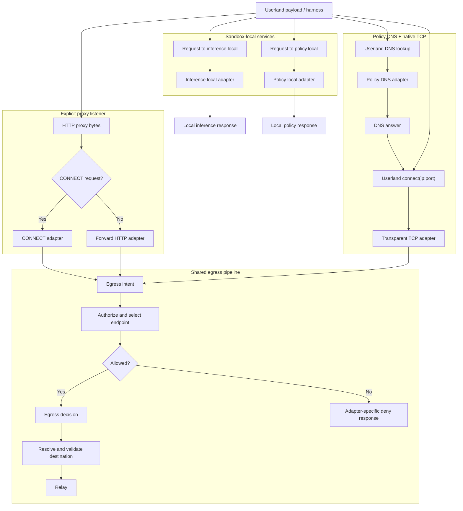
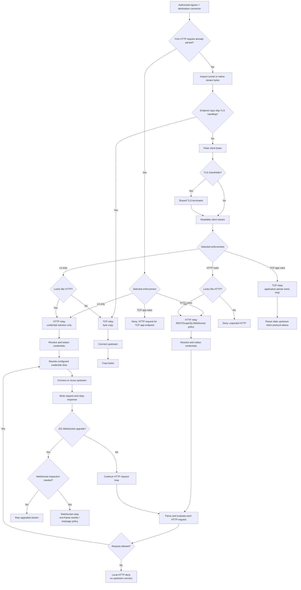
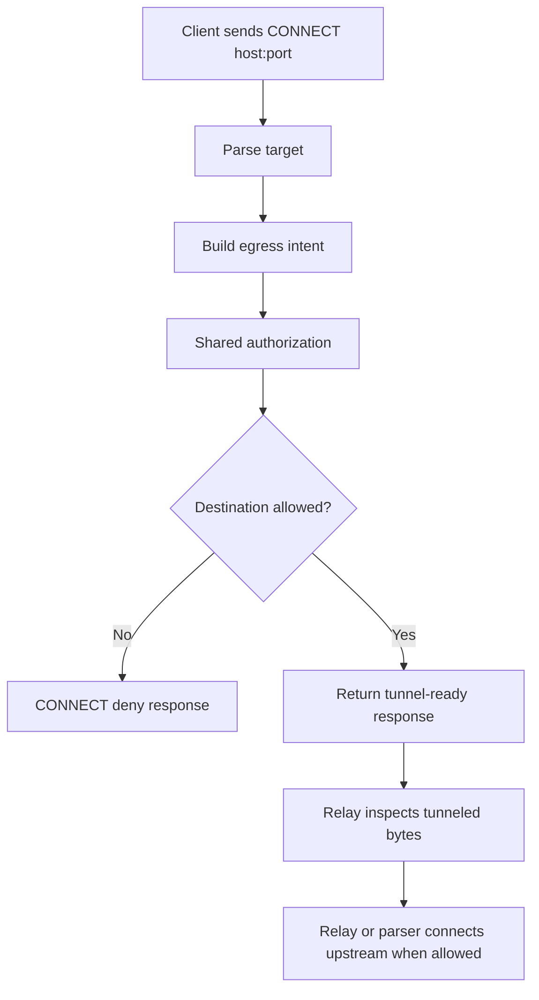
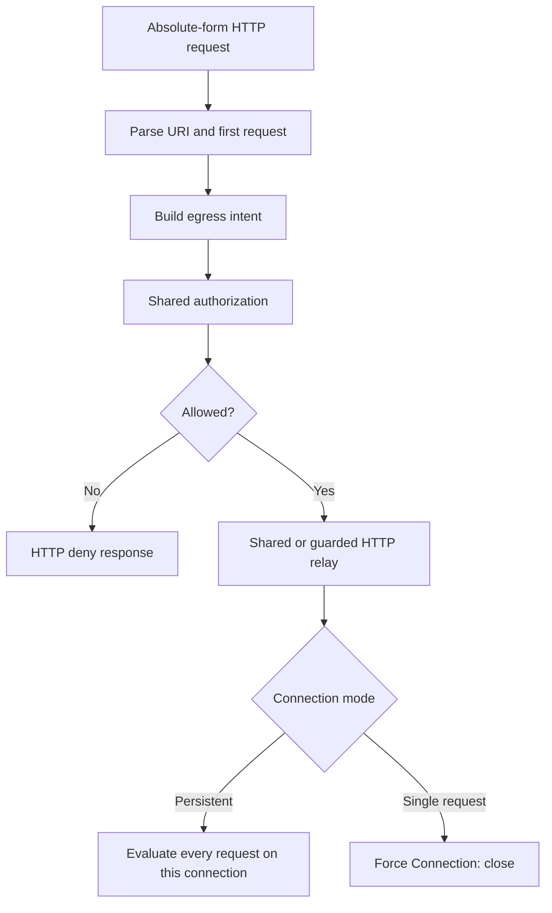
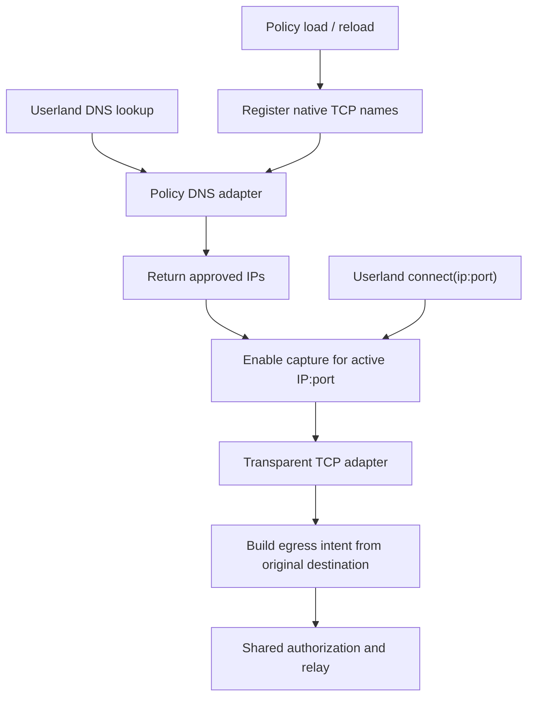
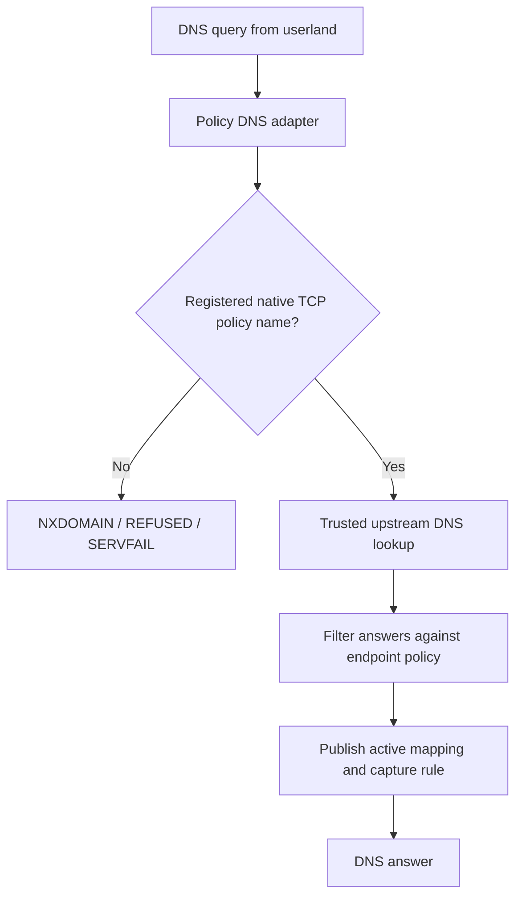
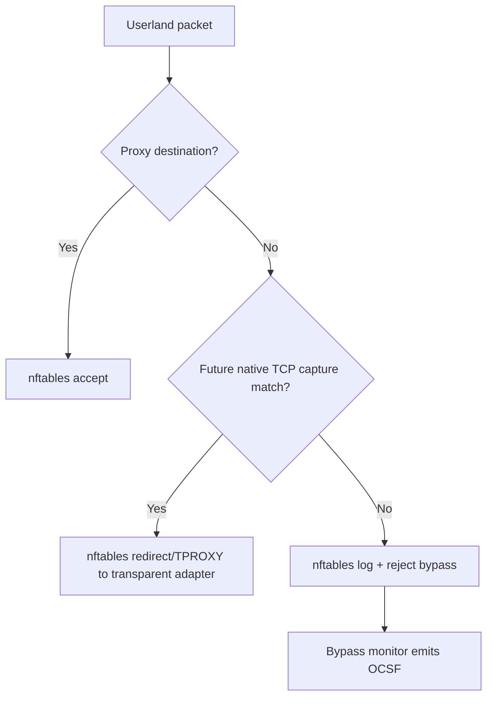
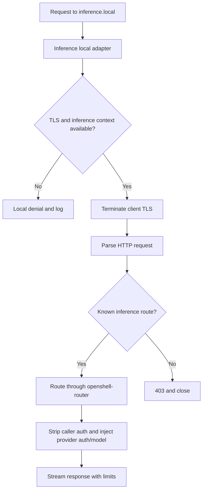
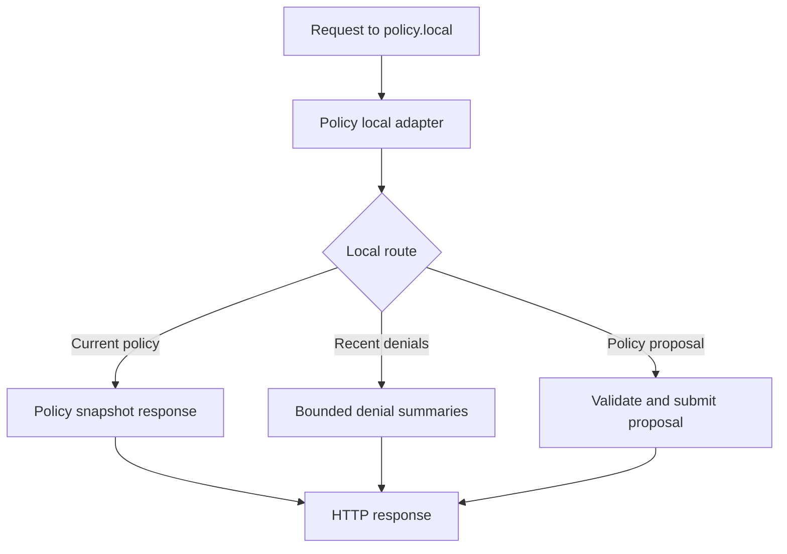

---
authors:
  - "@johntmyers"
state: draft
links:
  - https://github.com/NVIDIA/OpenShell/issues/1107
  - https://github.com/NVIDIA/OpenShell/pull/1083
  - https://github.com/NVIDIA/OpenShell/pull/1151
---

# RFC 0004 - Sandbox Proxy Egress Adapter Model

<!--
See rfc/README.md for the full RFC process and state definitions.
-->

## Summary

Refactor sandbox egress around one shared authorization and relay pipeline.
CONNECT, forward HTTP proxy, transparent native TCP, policy DNS,
`inference.local`, and `policy.local` should become adapters that translate
userland entry points into a common egress intent. Policy evaluation,
destination validation, credential injection, request-body rewrite,
WebSocket upgrade handling, protocol parsing, and relay ownership should happen
behind shared boundaries.

This RFC keeps the main direction in this document. Supporting detail lives in:

- [Current shape appendix](current-shape.md)
- [Technical design appendix](technical-design.md)
- [Implementation plan](implementation-plan.md)

## Motivation

The sandbox proxy has accumulated separate egress paths for CONNECT, forward
HTTP, local services, inference routing, endpoint metadata, credential
injection, and L7 policy. That makes security changes easy to apply to one path
and miss in another.

The target shape separates three concerns:

- **Adapters** describe how userland reached the proxy.
- **Authorization** decides whether that egress is allowed and what endpoint
  behavior applies.
- **Relays** own bytes, credentials, protocol parsing, and upstream dialing.

## Non-goals

- Replace CONNECT with forward proxy as the only explicit proxy mode.
- Add SOCKS support.
- Add HTTP/2 L7 parsing in this refactor.
- Redesign provider credential storage.
- Reintroduce iptables as the sandbox packet filtering backend.
- Use eBPF connect hooks for transparent capture. Native TCP capture needs a
  userland proxy in the byte stream for TLS termination and protocol parsing.

## Proposal

### Migration Big Rocks

1. **Transport adapters.** CONNECT, forward HTTP, transparent TCP, policy DNS,
   and local service routes become small entry adapters. They parse their
   surface and produce either an egress intent, a local response, or a DNS
   answer. They do not duplicate policy evaluation.
2. **Egress intent and decision.** The shared authorization boundary evaluates
   L4 policy once per connection intent and returns one decision containing the
   matched policy, matched endpoint, process identity, allowed IP metadata, TLS
   behavior, and protocol enforcement.
3. **Relays.** Relays receive an authorized destination connector, not an
   already-open upstream socket. HTTP relays evaluate every request before
   dialing, own REST request-body credential rewrite, and hand allowed
   WebSocket upgrades to the WebSocket relay. TCP application parsers own their
   protocol loop and decide when a validated upstream connection is needed.

### Unified Adapter Flow

### Relay Flow

Relay rules:

- HTTP credential injection happens in both HTTP modes: L4-only HTTP and
  HTTP-inspected.
- Credential injection includes request target, query, headers, opt-in REST
  request bodies, and opt-in client-to-server WebSocket text frames.
- HTTP L7 policy is evaluated before upstream dial for each request.
- WebSocket upgrade policy is evaluated as HTTP first. After an allowed `101`
  upgrade, the WebSocket relay owns frame parsing when text-frame credential
  rewrite, WebSocket transport policy, GraphQL-over-WebSocket policy, or safe
  compression handling is configured. Other upgraded streams remain raw.
- Forward HTTP must stay in the shared HTTP relay loop. It must not evaluate
  one request and then switch to raw bidirectional copy. Keeping forward HTTP
  single-request with `Connection: close` is also acceptable, but the invariant
  is that no follow-on request bytes reach upstream unevaluated.
- `protocol: tcp` means L4 authorization plus byte copy unless HTTP is detected
  for credential injection.
- Future TCP application parsers, such as Redis or Postgres, own the full
  message loop and can parse multiple commands over one TCP session.

### CONNECT Adapter

CONNECT remains the standard explicit proxy tunnel for HTTPS and arbitrary TCP.
It parses the CONNECT line into an egress intent, then waits for the shared
relay to decide if and when an upstream connection should be opened.

CONNECT should stay because forward proxy is only a plaintext HTTP request
format. CONNECT is still the generic explicit proxy mode for TLS and non-HTTP
TCP clients.

### Forward HTTP Adapter

Forward HTTP is compatibility for clients that send absolute-form HTTP requests.
The adapter parses the first request and hands it to the shared HTTP relay or
an equivalent guarded single-request relay.

### Transparent TCP Adapter

Transparent TCP supports native clients that do not know they are using a
proxy. The capture mechanism should be network namespace interception into a
userland proxy listener. Since main now uses nftables for sandbox bypass
enforcement, transparent capture should be designed as nftables
REDIRECT/TPROXY state in the inner sandbox network namespace, not as an
iptables path.

### Policy DNS

Policy DNS replaces static `/etc/hosts` snapshots for native TCP names. It is
query-driven: check whether the name is policy-eligible, resolve through trusted
DNS, filter returned IPs, publish the active endpoint mapping, and answer
userland.

The later `connect(ip:port)` still creates the egress intent and runs through
normal authorization.

### Network Enforcement Substrate

Current main uses nftables for bypass enforcement. It accepts proxy-bound
traffic and loopback, accepts established flows, then rejects and optionally
logs other TCP/UDP traffic for the bypass monitor. That is enforcement, not
native TCP capture.

The transparent TCP work should extend this nftables model with explicit
capture rules that run before the reject path and are scoped to active policy
DNS mappings.

### Local Service Adapters

`inference.local` and `policy.local` are sandbox-local APIs. They should use
the adapter model, but they do not represent normal external egress.

### Deployment Modes

The first implementation can remain embedded in `openshell-sandbox`, but the
proxy should be shaped around explicit runtime contracts.

| Mode | Shape | Main concern |
|------|-------|--------------|
| Embedded | Current sandbox process owns proxy modules | Lowest migration cost |
| Standalone process | Sandbox supervisor launches a proxy binary | Clear process/API boundary |
| Sidecar | Proxy runs outside the payload container but inside the sandbox boundary | Reliable process identity across namespaces |

A pluggable proxy must expose the configured userland surfaces, implement the
gateway APIs it needs, and prove equivalent policy enforcement through tests.
The nftables rules that force or reject userland traffic belong to the sandbox
network boundary even if the proxy process later moves into a standalone binary
or sidecar.

## Implementation plan

The migration plan lives in [implementation-plan.md](implementation-plan.md).
The intended order is: first add regression coverage, then introduce the shared
authorization result and destination validation, then preserve the current
forward HTTP single-request/guarded-relay invariant, then add shared TLS
handling, TCP parser boundaries, nftables-backed policy DNS capture, local
service adapters, and finally the runtime boundary cleanup.

## Risks

- Tightening endpoint metadata failures from fail-open to deny may expose
  latent policy or Rego errors.
- Deterministic endpoint selection may reject policies that currently load but
  only work by accident.
- Transparent TCP capture adds network namespace interception complexity.
- Transparent TCP capture must coexist with the current nftables bypass
  reject/log table without creating gaps where direct egress bypasses the proxy.
- Sidecar mode needs a reliable identity source for binary/path scoped policy.
- `policy.local` expands the sandbox-local control surface and needs strict
  route validation, body limits, redaction, and gateway authentication.

## Alternatives

- Keep patching each current proxy path separately. This has the lowest short
  term cost but keeps the security surface duplicated.
- Replace CONNECT with forward proxy. This does not work for arbitrary TCP and
  is not a replacement for HTTPS tunnels.
- Build only transparent TCP. This helps native clients but does not replace
  explicit proxy support used by common HTTP tooling.

## Open questions

1. Should overlapping endpoint metadata be rejected at policy load time, or
   should policy name plus endpoint index define precedence?
2. Should missing TLS state fail closed for credential-capable or inspected
   endpoints?
3. Should direct IP connects to a policy-DNS-resolved TCP endpoint be accepted,
   or should DNS query correlation be required for stricter modes?
4. What TTL cap and stale-generation grace period should policy DNS use?
5. Which process identity source should sidecar mode use when it cannot inspect
   payload process metadata through local `/proc`?
6. Which proxy capabilities should be negotiated with the gateway at startup?

## Expected result

Adding a new HTTP-family protocol parser should require parser code, policy
schema/Rego support, tests, and docs. It should not require new CONNECT and
forward-proxy branches. REST, GraphQL, WebSocket upgrade policy, request-body
credential rewrite, and WebSocket text-frame rewrite should all remain behind
the shared HTTP/WebSocket relay boundary.

Adding a native TCP application parser should require policy DNS/capture
support, a TCP application parser, policy rules, tests, and docs. Plain
`protocol: tcp` remains L4 authorization plus byte relay.
