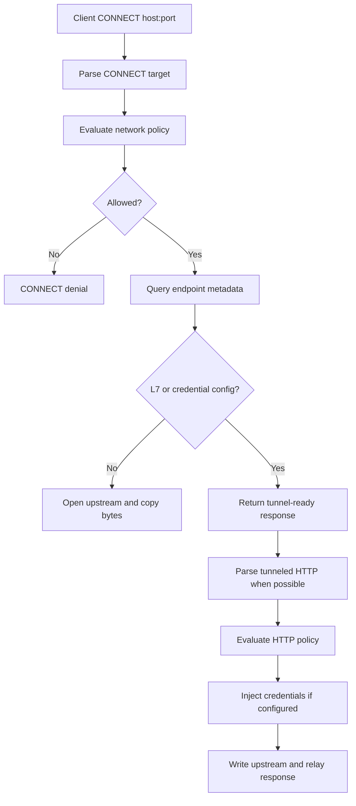
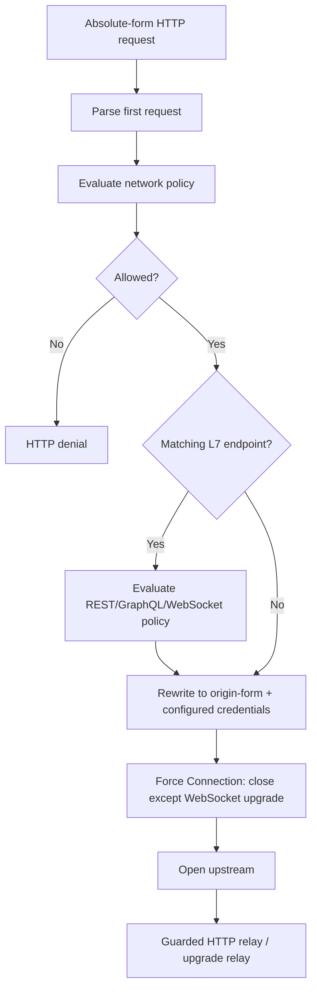
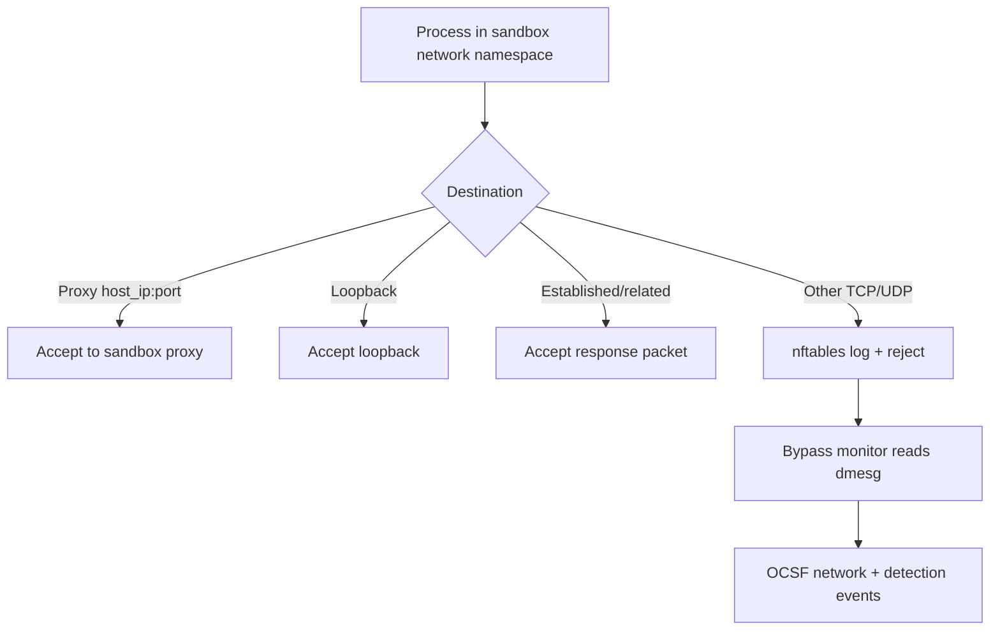
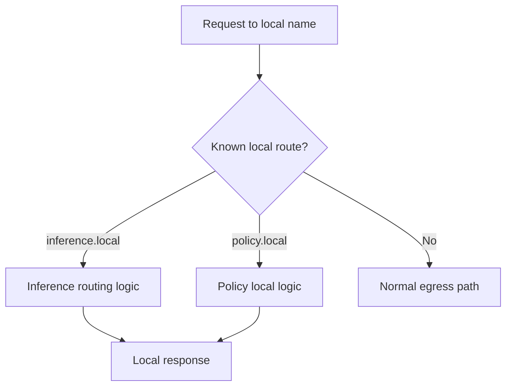

# Current Shape Appendix

This appendix records the current proxy shape and the review findings that
motivate the adapter model. The main RFC intentionally keeps these details out
of the direction document.

## Current Entry Points

The sandbox proxy currently handles multiple userland-facing paths in the same
large module:

- CONNECT proxy traffic for HTTPS and generic TCP tunnels.
- Forward HTTP proxy traffic for absolute-form HTTP requests.
- Local service routes such as `inference.local`.
- Network namespace bypass enforcement through nftables reject/log rules.
- Policy and endpoint metadata lookups through OPA/Rego.
- DNS resolution and endpoint validation for CONNECT and forward HTTP egress.
- Credential injection and redaction for provider-backed HTTP egress.
- Opt-in REST request-body credential rewrite.
- L7 REST, GraphQL, WebSocket, and GraphQL-over-WebSocket enforcement.

The issue is not that these features exist. The issue is that entry mechanisms,
policy evaluation, endpoint metadata lookup, credential injection, and byte
relay decisions are interleaved.

## Current CONNECT Shape

This path has the strongest HTTP relay behavior because it can keep parsing
requests on a long-lived tunnel and enforce L7 rules per request.

## Current Forward HTTP Shape

The latest main branch no longer has the old raw-copy-after-first-request shape
for ordinary forward HTTP. It rewrites ordinary requests with `Connection:
close`, uses guarded HTTP relay helpers for body handling, and sends allowed
WebSocket upgrades through the same upgrade relay. That is a narrower surface
than the historical bidirectional copy, but it is still implemented separately
from the CONNECT relay path.

## Current Network Namespace Enforcement

The sandbox now installs an `inet` nftables filter table for bypass
enforcement. The table accepts proxy-bound traffic, loopback, and established
flows, then rejects and optionally logs other TCP/UDP traffic. It does not
currently redirect native TCP connections into the proxy.

## Current Local Service Shape

Local routes are userland-facing proxy surfaces. They should stay distinct from
external egress while still fitting the adapter model.

## Findings To Preserve

### Invariant: forward proxy must not relay unevaluated follow-on HTTP bytes

The historical forward path evaluated at most the first absolute-form request,
rewrote it, then switched to bidirectional copy. Bytes already buffered after
the first header block, or later pipelined requests on the same client/upstream
connection, could reach upstream without the CONNECT L7 relay's per-request
parser/evaluator.

Latest main mitigates this by forcing ordinary forward HTTP to one request per
connection and by using guarded relay helpers. The adapter model should
preserve the invariant either by keeping forward HTTP single-request/close or
by passing the first parsed request into a shared HTTP relay loop.

### Endpoint config is not tied to deterministic matched policy

The policy name used for L4 authorization and logging can be selected through a
different precedence rule than endpoint metadata. With overlapping host, port,
and binary rules, allowed IPs, TLS behavior, enforcement, and
`allow_encoded_slash` can come from a different endpoint than the policy name
logged and used for L4 allow.

The adapter model requires authorization to return one decision with one
deterministic matched endpoint.

### Endpoint metadata query failures fail open to L4 behavior

If endpoint metadata lookup fails, callers can interpret the result as no L7
configuration and downgrade to credential-only or raw L4 relay.

The adapter model treats endpoint metadata as part of the authorization result.
Failure to materialize required metadata should deny rather than erase extended
configuration.

### Control-plane port block only applies on one resolution path

Blocked control-plane ports are enforced inside one allowed-IPs validation
path, while the normal host-based path uses a different validation route.

The adapter model moves resolution, allowed IP checks, SSRF checks, and
control-plane port blocks into shared destination validation.

## Existing Feature Inventory

The refactor should preserve:

- CONNECT explicit proxy support.
- Forward HTTP explicit proxy support.
- nftables bypass reject/log enforcement.
- Provider credential injection and redaction.
- REST request-body credential rewrite.
- WebSocket text-frame credential rewrite.
- REST endpoint method/path policy.
- GraphQL L7 policy.
- WebSocket transport and GraphQL-over-WebSocket policy.
- Inference routing through `inference.local`.
- Agent-facing policy routes through `policy.local`.
- Timeout and resource tracking for client, upstream, and local service work.
- Structured OCSF logging for network and HTTP policy outcomes.
- SSRF and internal address protections.
- Control-plane port protection.
- `allowed_ips` endpoint restrictions.
- TLS termination for inspectable client connections.
