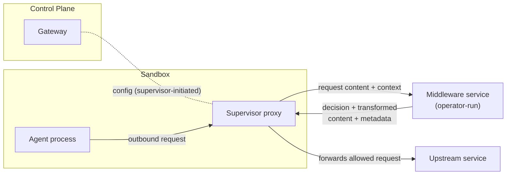
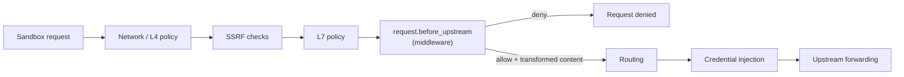

---
authors:
  - "@pimlock"
state: draft
links:
  - https://github.com/NVIDIA/OpenShell/issues/1043
  - https://github.com/NVIDIA/OpenShell/issues/1733
  - https://github.com/NVIDIA/OpenShell/issues/1734
---

# RFC 0005 - Sandbox Egress Middleware

## Summary

This RFC proposes the introduction of sandbox proxy egress middleware: a set of hooks that can inspect, transform, block, and annotate outbound sandbox requests at various steps of request processing flow. The feature described here establishes the initial support needed to validate the contract, policy integration, and operational model through early experiments; it is expected to evolve over time, and future extensions are called out throughout this RFC.

## Motivation

OpenShell already controls *where* a sandbox can connect. The supervisor enforces network policy on every outbound connection and only allows egress to approved endpoints. Today, that control stops at the destination: once a connection is allowed, the request can carry any payload. Network policy can decide whether a sandbox may talk to `api.openai.com`, but it cannot decide whether a particular request to `api.openai.com` should be allowed based on what that request contains.

Users have a need to control the content that leaves the sandbox. Agents routinely send prompts, tool arguments, uploaded files, which may contain sensitive information. Acting on that traffic, requires inspecting the request itself (e.g. redacting PII or secrets before they leave the sandbox, blocking requests that carry confidential documents, requiring sensitive content to be processed by a local model).

This RFC introduces egress middleware: hooks that run within the supervisor proxy flow and can inspect, transform, block, and annotate outbound requests based on their content. Rather than building a fixed set of content checks into OpenShell, the middleware contract lets operators process selected requests through trusted services that implement their own logic. OpenShell cannot embed every useful detection and transformation approach. We want to allow dedicated PII tools such as Presidio or NeMo Anonymizer, organization-specific classifiers, and experimental research scanners to be plugged in. A stable contract lets teams and researchers iterate on different implementations without changing OpenShell itself.

OpenShell may still ship first-party middleware for a small number of operations where it makes sense. First-party and third-party middleware share the same contract; the difference is only who builds and operates the service.

### Use-case: Privacy Guard

Privacy Guard is the motivating use case for this RFC. It is middleware that inspects outbound request content for sensitive data and applies a mitigation before the request leaves the sandbox. We use it throughout this document as a concrete example because it exercises every property the contract needs: policy-controlled placement in the proxy flow, an external service configuration, a request/response contract, failure behavior, and audit-safe findings.

Consider an agent configured with a cloud model. The operator wants uploaded images to never reach that model. With egress middleware, they configure Privacy Guard on requests bound for the model endpoint. When the agent uploads an image and asks the model about it, the middleware inspects the request content, detects the image, and redacts it -- replacing it with a placeholder (for example, `image upload is disabled for this model`) before the request leaves the sandbox.

Beyond redaction, middleware also produces structured findings and metadata about a request. This metadata is intended to be stable enough for a future model router to consume - for example, to route sensitive requests to a local model instead.

## Non-goals

- **Model routing.** This RFC defines the metadata that middleware emits, but not the component that consumes it to pick a model. Routing a request to a different model based on findings is a separate concern tracked in [#1734](https://github.com/NVIDIA/OpenShell/issues/1734). Here we only ensure the metadata contract is stable enough for a future router to build on.
- **A general-purpose middleware framework.** The first version targets outbound request processing in the supervisor proxy flow. It is not an arbitrary plugin system for every extension point in OpenShell, and it does not cover response inspection or non-egress hooks. Those are possible future extensions, not part of this contract.
- **Constraining or sandboxing the middleware itself.** A middleware gets raw access to request content. OpenShell routes payloads to a service the operator chose to trust; it does not sandbox the middleware, verify its behavior, or prevent a malicious one from mishandling the data it inspects. Initially, trust is the operator's responsibility, the same way it is for sandbox images. Stronger guarantees, such as mutual authentication between the supervisor and the middleware or running the middleware in its own sandbox, will follow but are out of scope here.
- **Runtime management of middleware.** Middleware is declared in gateway configuration. A runtime CLI or API to add, list, or validate middleware is deferred.
- **Guaranteeing detection correctness.** OpenShell places the hook and enforces the decision the middleware returns, but it does not guarantee that a middleware actually catches all sensitive content. Detection quality is the middleware's responsibility.
- **Support for multiple deployment modes.** The first version commits to a single deployment shape: an externally managed middleware service. Other shapes such as WASM middleware, OpenShell-managed images, sidecars, and running the middleware inside its own sandbox are not designed in this RFC. They remain explicitly open for later evaluation rather than being baked into the initial contract. See [appendices/deployment-options.md](appendices/deployment-options.md).

## Terminology

This RFC uses the following terms with specific meanings.

- **Egress.** An outbound request a sandbox sends to an upstream destination through the supervisor proxy. Middleware acts on the parsed request the supervisor has already admitted and is about to forward, not on raw packets or arbitrary network activity.
- **Middleware.** A service that inspects, transforms, blocks, or annotates egress requests through the contract defined in this RFC. A middleware owns its detection and transformation logic and never makes the upstream call itself; the supervisor always owns the upstream call.
- **Registered middleware.** A middleware an operator declares in gateway configuration as a name plus an endpoint. Registration is an administrative action that establishes which endpoints may receive raw request content; policy authors can then reference a registered middleware by name but cannot point traffic at an arbitrary endpoint.
- **Built-in middleware.** A middleware that ships inside the supervisor binary and is served in-process over the same gRPC contract, with no network hop and no gateway registration. Built-in names are reserved with the `openshell-` prefix.
- **Hook.** A defined point in the supervisor proxy flow where the supervisor invokes a middleware. This version defines a single hook, `request.before_upstream`, which runs after network and L7 policy admit a request and before credential injection and upstream forwarding. The design allows more hooks later.
- **Middleware config.** The service-specific configuration fragment a policy supplies to a middleware. OpenShell does not interpret it; it passes the fragment to the middleware and relies on `ValidateConfig` to check it.
- **Capabilities.** The self-description a middleware returns from `GetCapabilities`: its identity and version, the hooks it implements, and operational limits such as maximum body size and timeout. OpenShell validates that a registered middleware's capabilities support every policy that references it.
- **Decision.** The allow-or-deny outcome a middleware returns for a request. `allow` lets the request proceed (possibly transformed); `deny` short-circuits it. This vocabulary matches the rest of the OpenShell policy system.
- **Transformation.** A middleware returning replacement content, and any allowed header mutations, that the supervisor forwards in place of the original request. A later middleware in a chain sees the previous stage's transformed content.
- **Finding.** A structured, audit-safe observation a middleware reports about a request, such as a label, count, and confidence. A finding never carries raw matched values, redacted spans, or the original sensitive content.
- **Metadata.** Namespaced key/value annotations a middleware emits into a request-local bag for downstream consumers, such as a future model router. Metadata uses stable primitive types, never carries raw sensitive values, and is marked for where it may be used (audit, routing, or internal-only).
- **Chain.** The ordered set of middleware that applies to a single request. Each middleware runs in turn, a later stage sees the previous stage's transformed content, a `deny` short-circuits the remaining stages, and each middleware runs at most once per request.

## Proposal

The first version makes egress middleware concrete without prematurely standardizing every future deployment model. The chosen path is an externally managed middleware service: the operator runs the service, OpenShell routes selected egress through it, and the middleware returns a decision plus optional transformed content and metadata. This keeps the first iteration focused on the contract, failure behavior, and sandbox integration while leaving other deployment shapes open (see [appendices/deployment-options.md](appendices/deployment-options.md)).

The research preview does not define production authentication between the supervisor and middleware service. Unauthenticated plaintext middleware calls are allowed only as an explicit insecure mode for trusted local or isolated development environments; TLS, mTLS, invocation tokens, and middleware identity binding are deferred to a follow-up auth design. See [appendices/protocol-extensions.md](appendices/protocol-extensions.md#middleware-authentication).

### Architecture

Three components participate:

- **Gateway (control plane).** Registers middleware, validates that each registered service supports the policies that reference it, and distributes the effective middleware configuration to supervisors. The gateway never sees live request bodies; it stays off the hot path.
- **Supervisor proxy (data plane).** Calls the middleware on the request hot path, enforces the returned decision, forwards only the content the middleware returns, and carries emitted metadata forward. The supervisor owns the upstream call.
- **Middleware service.** An operator-run service, reachable from supervisors over gRPC, that inspects the request and returns a decision, optional transformed content, findings, and metadata. It owns all detection and transformation logic and never makes the upstream call itself.



### Hooks and placement

A middleware service provides hook implementations that the supervisor invokes at defined points in the proxy flow. This version defines a single hook, `request.before_upstream`, and is structured so more hooks can be added later. The supervisor invokes the hook after network and L7 policy have allowed the request and before OpenShell injects upstream credentials or forwards the request.



This ordering is deliberate:

- Network and L7 policy run first, so OpenShell never sends already-denied traffic to a middleware service.
- Middleware runs before credential injection, so a middleware never receives OpenShell-managed upstream credentials.
- Routing runs after the hook, so route selection (for example, choosing a model for a logical endpoint such as `inference.local`) can use metadata the middleware emitted.
- The upstream call stays owned by the supervisor, never the middleware.

The hook operates on a parsed L7 request, so it runs only on traffic OpenShell introspects at L7 (HTTP today). Opaque TCP or TLS passthrough carries no parsed request for a middleware to act on and is outside the scope of the hook. Because OpenShell fails closed when a required middleware cannot process a request, attaching middleware to traffic implies that traffic must be L7-introspected; this RFC may require that explicitly so a policy cannot silently bypass a middleware by falling back to L4.

There is no request hook in the supervisor proxy today, so this is a net-new, synchronous, per-request call. Timeout and failure behavior are therefore load-bearing parts of the design rather than afterthoughts. The exact placement relative to credential handling, which is interleaved with L7 in the current relay path, is detailed in the pipeline-placement appendix. Other hook stages such as pre-policy classification, response inspection, and streaming message hooks are possible future extensions and are out of scope for v1.

### The middleware contract

The contract has two parts: a configuration-time handshake and a request-time hook. The request-time hook runs on the *hot path* -- the synchronous, per-request path through the supervisor proxy, as opposed to the control-plane path used to fetch config. Middleware only sits on this path for sandboxes whose policy configures it: a sandbox with no middleware in its policy is unaffected and pays no per-request cost. Middleware is therefore an explicit opt-in, and this change is transparent to existing usage.

Configuration-time:

- `GetCapabilities` reports the service identity and version, the hook stages it implements, and operational limits such as max body size and timeout.
- `ValidateConfig` lets the service validate its own service-specific configuration fragment.

Request-time:

- `ProcessRequestBeforeUpstream` carries the request plus context: request identity, endpoint and header context, the bounded body, and the middleware's configuration from policy.
- The response is a decision OpenShell can apply directly: `allow` or `deny`, optional replacement content and allowed header mutations, findings (labels, counts, confidence, never raw matched values), and namespaced metadata.

A simplified sketch of the gRPC contract:

```protobuf
service Middleware {
  // Configuration-time
  rpc GetCapabilities(CapabilitiesRequest) returns (Capabilities);
  rpc ValidateConfig(ValidateConfigRequest) returns (ValidateConfigResponse);

  // Request-time hook. Declared as a bidirectional stream so large bodies can be
  // chunked later; v1 exchanges exactly one ProcessRequest and one ProcessResponse.
  rpc ProcessRequestBeforeUpstream(stream ProcessRequest) returns (stream ProcessResponse);
}

message Capabilities {
  string name = 1;
  string version = 2;
  repeated string hooks = 3;            // e.g. "request.before_upstream"
  uint64 max_body_bytes = 4;
  uint32 timeout_ms = 5;
  repeated string metadata_namespaces = 6;
}

// Context plus body as two top-level fields, so the body is cleanly separable.
// v1 sets both in one message; a future stream sends body-only follow-ups.
message ProcessRequest {
  RequestContext context = 1;
  bytes body = 2;                       // bounded
}

message RequestContext {
  string request_id = 1;
  string sandbox_id = 2;
  Endpoint endpoint = 3;                // scheme, host, port, method, path
  map<string, string> headers = 4;      // safe subset
  google.protobuf.Struct config = 5;    // service-specific, from policy
}

// Outcome plus optional replacement body.
message ProcessResponse {
  Outcome outcome = 1;
  bytes body = 2;                       // replacement content when transformed
}

message Outcome {
  Decision decision = 1;                // ALLOW or DENY
  string deny_reason = 2;               // safe, machine-readable
  map<string, string> set_headers = 3;  // subject to an OpenShell allow-list
  map<string, string> metadata = 4;     // namespaced, no raw values
  repeated Finding finding = 5;         // labels, counts, confidence
}

enum Decision {
  DECISION_UNSPECIFIED = 0;
  ALLOW = 1;
  DENY = 2;
}
```

The interface is gRPC. The hot-path RPC is declared as a bidirectional stream, but v1 exchanges exactly one `ProcessRequest` and one `ProcessResponse` over it: the supervisor buffers the bounded body and the middleware replies once. Declaring it as a stream now is deliberate, because gRPC method cardinality cannot change compatibly. It lets a later version chunk large payloads without altering the method signature. Possible extensions (chunked streaming, additional hooks, semantic context) are collected in the [protocol-extensions appendix](appendices/protocol-extensions.md), including what streaming does and does not buy. The baseline middleware ships in the supervisor and is served in-process over the same gRPC contract, with no network hop. The full request/response schema and capability fields live in the request/response-contract appendix.

### Registration and delivery

The operator registers middleware in the gateway configuration: each entry is a name and an endpoint. This preserves the trust boundary. The endpoint sees raw payloads and is operator-owned infrastructure, so declaring one is an administrative action, while policy authors can only reference middleware by a registered name rather than point traffic at an arbitrary endpoint. In single-player mode one person holds both roles, but the split still holds in shared deployments.

The portable transport is gRPC over TCP/TLS, reachable from every supervisor across Docker, Podman, VM, and Kubernetes drivers (Unix sockets are not, so they are not a baseline). A loopback endpoint such as `127.0.0.1:1234` is translated to `host.openshell.internal` so a supervisor can reach a service running on the gateway host.

```toml
[[openshell.proxy.middleware]]
name = "anonymizer"
grpc_endpoint = "http://127.0.0.1:1234"
allow_insecure = true   # research preview: plaintext gRPC, no auth (see appendix)

[[openshell.proxy.middleware]]
name = "agent-traces-exporter"
grpc_endpoint = "http://127.0.0.1:1235"
allow_insecure = true
```

During the research preview, a plaintext `http://` endpoint must be paired with an explicit `allow_insecure = true` on the same entry; OpenShell otherwise rejects a non-TLS endpoint rather than silently sending inspected content in the clear. This keeps the insecure choice deliberate and auditable in gateway configuration while production auth is deferred (see [appendices/protocol-extensions.md](appendices/protocol-extensions.md#middleware-authentication)).

Built-in middleware ships in the supervisor binary and needs no registration. Built-in names are prefixed `openshell-` (for example `openshell-secrets`), and that prefix is reserved so user-defined middleware cannot use it.

Supervisors receive the effective configuration over the same authenticated config path they already use for policy, provider, and inference config. Because the registered endpoint is reachable from both the gateway and the supervisors, capability validation runs at the gateway (at config load and when a policy references a middleware) and again at the supervisor before traffic flows; a validation failure fails the load rather than silently disabling the middleware. This gateway-side reachability is a property of the service deployment mode - a future sidecar mode would shift validation entirely to the supervisor.

### Policy integration

Policy decides which middleware runs for which traffic, how it is configured, and what happens on failure. To avoid duplicating the same rules across many endpoints, middleware is described once in a reusable layer that network endpoints then reference by name, rather than being repeated inline on every endpoint.

A middleware entry references a registered middleware (or a built-in by its `openshell-` name), supplies its service-specific configuration, sets failure behavior (`on_error`, fail-closed by default when processing is required), and selects which requests it applies to. OpenShell does not interpret the configuration; it passes it to the middleware and relies on `ValidateConfig` to check it.

Network endpoints attach one or more middleware as an ordered chain: each runs in turn, a later stage sees the previous stage's transformed content, a `deny` short-circuits the chain, and metadata accumulates in namespaced buckets. Policy validation combines OpenShell structural checks (the referenced middleware exists, the hook is supported, limits are in bounds, selectors are well-formed) with the service's own `ValidateConfig`. If validation fails, sandbox creation or policy update fails before any traffic reaches the hook. The concrete policy schema and its composition with the existing OPA/Rego evaluation live in the policy-integration appendix.

```yaml
network_middlewares:
  # Built-in secret redaction shipped in the supervisor; no gateway registration needed.
  - name: openshell-secrets
    config:
      secrets: redact
    on_error: deny
    requests:
      include: ["*.github.com"]
      exclude: ["graphql.github.com"]

  - name: anonymizer        # matches the gateway config entry
    config:
      pii: redact           # validated by the middleware via ValidateConfig
    on_error: deny
    requests:
      include: ["*"]        # applies to every request

  - name: agent-traces-exporter
    config:
      exclude_images: true
    on_error: allow

network_policies:
  github_api:
    # no middleware list: openshell-secrets and anonymizer both apply through their global selectors
    endpoints:
      - host: api.github.com
        port: 443
        protocol: rest
        access: read-only

  nv_inference:
    # anonymizer is global, but listing it here fixes its order before agent-traces-exporter
    middleware: [anonymizer, agent-traces-exporter]
    endpoints:
      - host: inference-api.nvidia.com
        port: 443
        protocol: rest
```

With this policy, `anonymizer` applies to every request through its global selector. Requests to `api.github.com` have secrets redacted and are then anonymized (both run via their global selectors, in `network_middlewares` order). Requests to `inference-api.nvidia.com` are anonymized and then exported to the trace collector: `anonymizer` is global, but listing it explicitly in the policy fixes its order ahead of `agent-traces-exporter`. If `anonymizer` times out or errors the request is denied; if `agent-traces-exporter` fails the request is allowed through.

### Middleware ordering

When more than one middleware applies to a request, the order is well-defined:

- Middleware are defined once in a top-level `network_middlewares` list and attached to traffic from network policies through an explicit `middleware: [...]` list. That list determines the relative order of the middleware it names.
- A middleware can also include itself globally through its own request selector (for example `include: ["*"]`), independent of any policy attachment. Globally-included middleware run *before* the policy-attached list, in the order they appear in `network_middlewares`.
- A middleware runs at most once per request. If the same middleware is both globally included and named in a policy's list (or listed more than once), it executes a single time, at the position given by the policy list.

For example, if `openshell-secrets` includes `*.github.com` globally and the policy for `api.github.com` attaches `middleware: [anonymizer]`, a request to `api.github.com` runs `openshell-secrets` first (global), then `anonymizer` (policy list).

### Metadata and downstream routing

Beyond allow/deny and transformation, middleware emits namespaced metadata (for example `request.modalities`, `privacy.sensitivity`, `privacy.requires_local_model`) into a request-local metadata bag. Metadata uses stable primitive types, never carries raw sensitive values, and is marked for where it may be used: audit, routing, or internal-only. This is the seam a future model router consumes; the router itself is out of scope ([#1734](https://github.com/NVIDIA/OpenShell/issues/1734)).

How metadata keys are namespaced to avoid collisions between middleware is left open. One natural option is to derive the namespace from the middleware name (for example `anonymizer.sensitivity`), which prevents conflicts without a central key registry. Because nothing consumes middleware metadata in v1, this RFC defers the exact namespacing scheme to the work that introduces a consumer.

### Audit and logging

A middleware decision is observable sandbox behavior, so it is recorded as an OCSF event, consistent with how the supervisor already logs network and L7 enforcement. This RFC commits to the event categories and the safety rules; exact field mappings live in the failure-and-audit appendix.

- **Per-request decisions** are `HttpActivity` events, since the middleware is an L7 enforcement point. Each invocation records the middleware name, the decision (`allow` or `deny`), whether content was transformed, latency, and the policy and endpoint context. Allowed requests are `Informational`; denials are `Medium`.
- **Failures that block traffic** dual-emit: the denial above plus a `DetectionFinding`, so operators can alert when a required middleware is unavailable, times out, returns a malformed response, or fails a capability check. The finding is `High`.
- **Configuration events** are `ConfigStateChange` events: middleware registration loaded, capability validation result, and policy validation outcome. A validation failure that fails the config load is recorded here.

These events must never leak the content they describe. The OCSF JSONL may be shipped to external systems, so:

- Raw request content, matched values, redacted spans, and service-config secrets are never logged.
- Events carry only safe summaries: middleware and policy names, decision, latency, finding labels and counts, and failure reason.

This mirrors the middleware response contract, which already forbids the service from returning raw matched values.

## Implementation plan

Egress middleware stays opt-in throughout: until a policy references a middleware, no sandbox calls one and the proxy hot path is unchanged. It ships in two phases, the first proving the entire contract in-process before any networking, registration, or auth exists.

**Phase 1 - in-process middleware.** Define the `Middleware` gRPC contract (`GetCapabilities`, `ValidateConfig`, `ProcessRequestBeforeUpstream`), implement its server side in the supervisor, and ship one built-in middleware (for example `openshell-secrets`) behind the reserved `openshell-` prefix. The supervisor invokes the `request.before_upstream` hook in the L7 relay's per-request path - after policy admits the request and before credential injection - buffering the bounded body, enforcing the decision, applying transformation, running a chain in order, applying `on_error`, and accumulating metadata. Policy gains the top-level `network_middlewares` list and the per-policy `middleware: [...]` attachment, and decisions are recorded as the OCSF events described above. This exercises the whole contract, policy integration, and hot-path enforcement end to end with no external dependencies.

**Phase 2 - external middleware service.** Open the same contract to operator-run services. The gateway gains the `[openshell.proxy]` configuration table (name, gRPC endpoint, `allow_insecure`), runs capability validation at config load and on policy reference, and delivers the effective middleware configuration to supervisors over the existing authenticated config path, where it is re-validated before traffic flows. This phase adds the registration trust boundary, the insecure research-preview mode, and the deployment guidance in [appendices/deployment-options.md](appendices/deployment-options.md) - none of which Phase 1 requires.

### Backwards compatibility and migration

There is nothing to migrate. The feature is additive and opt-in: a sandbox whose policy declares no middleware behaves exactly as it does today and pays no per-request cost, and existing policy and gateway config files stay valid because every new field is optional. The one shared surface is request-body buffering - middleware that needs the full body reuses and may extend the proxy's existing bounded buffering boundary, so its limit must be reconciled with the current cap rather than introducing a second, conflicting one. This interaction is covered under Risks and in the failure-and-audit appendix.

### Research preview

The first release is a research preview. The contract, policy surface, and scope are provisional and may change without the usual compatibility guarantees, and production authentication between the supervisor and external middleware is deferred (see [appendices/protocol-extensions.md](appendices/protocol-extensions.md#middleware-authentication)). The goal of the initial implementation is to validate the contract and operational model through early experiments - a built-in middleware plus a small number of trusted external services - before committing to long-term stability.

## Risks

Adding a synchronous, content-aware hook to the egress path has real costs. The most significant:

- **Hot-path latency and a new per-request dependency.** There is no request hook in the proxy today. Each applicable request now makes a synchronous call to a middleware and blocks on its reply, so middleware latency becomes request latency and the middleware becomes a new failure surface on the data plane. This is bounded by opt-in (only sandboxes whose policy attaches middleware pay any cost), by per-middleware timeouts, and by built-in middleware running in-process with no network hop, but for those sandboxes the tax is unavoidable.
- **Fail-closed breaks workloads.** Denying traffic when a required middleware is unavailable, times out, or returns a malformed response is the safe default, but it converts a middleware outage into a sandbox outage. The opposite default leaks the very content the middleware exists to control. There is no choice that is both safe and always available; `on_error` makes the tradeoff explicit per middleware, but operators can still pick a default that surprises them.
- **Body buffering and size limits.** Inspecting content means buffering a bounded request body instead of streaming it, which adds memory cost and interacts badly with growing payloads (for example inference requests whose context expands each turn until it exceeds the cap). An over-limit request must either be denied (breaking the workload) or passed through unprocessed (egressing content that should have been inspected). This boundary must also reconcile with the proxy's existing credential-rewrite buffering cap rather than introduce a second, conflicting limit. See the failure-and-audit appendix.
- **Trusting an unsandboxed service with raw content.** Middleware receives raw request payloads, and OpenShell does not sandbox it, verify its behavior, or prevent it from mishandling or exfiltrating what it inspects. A buggy or malicious middleware is a direct data-exposure path. Trust in the middleware is the operator's responsibility, the same as trust in a sandbox image, but the blast radius here is in-flight request content.
- **A false sense of coverage.** The hook runs only on L7-introspected (TLS-terminated, HTTP) traffic; L4/opaque passthrough, encrypted or otherwise opaque bodies, and content the middleware simply fails to detect all flow through without effective inspection. An operator who assumes "middleware is attached, therefore content is checked" can be wrong. The design mitigates the L4 gap by requiring that middleware-attached endpoints be L7-introspected, but detection correctness and opaque payloads remain inherent limitations, not bugs.
- **No transport authentication in the research preview.** Production auth between the supervisor and an external middleware is deferred, and the insecure mode allows plaintext gRPC. Because a middleware can allow, deny, or transform egress, an impersonated or eavesdropped middleware is a policy-enforcement bypass, not just an observability gap. The insecure mode is gated behind an explicit `allow_insecure` opt-in and is unsuitable for shared or untrusted networks; full auth is tracked as follow-up work. See [appendices/protocol-extensions.md](appendices/protocol-extensions.md#middleware-authentication).
- **Added surface to build, version, and maintain.** A new gRPC contract, policy schema, gateway configuration table, and capability handshake are all long-lived surfaces with compatibility obligations, and middleware chains add ordering semantics operators must reason about. The research-preview framing keeps the contract provisional for now, but the long-term maintenance cost is real and is the main argument for keeping v1 deliberately small.

The cost of *not* doing this is leaving content-level egress control entirely outside OpenShell: operators who need to redact, block, or annotate outbound content based on what it contains would have to build bespoke proxies around the sandbox, losing the policy integration, audit, and trust boundary the supervisor already provides.

## Alternatives

- **Build content checks into OpenShell directly.** A fixed, built-in set of DLP/redaction rules avoids a contract and an external service. Rejected as the primary model: OpenShell cannot embed every useful detection and transformation approach, and a stable contract lets dedicated tools and research scanners iterate without changing OpenShell. First-party built-in middleware still ships for narrow cases, over the same contract.
- **REST instead of gRPC.** A REST/JSON hook is simpler to call, and with OpenAPI it could still offer a capability handshake and a typed contract. Rejected because gRPC's typing is stronger and its streaming story is cleaner: the hot-path RPC is already declared as a stream so large bodies can be chunked later without a breaking signature change, which is awkward to match over REST. OpenShell already uses gRPC across its service contracts, so staying on a single toolchain avoids a second RPC stack to build, secure, and maintain.
- **Other deployment modes (WASM, sidecar, in-sandbox).** In-process WASM filters or sidecars avoid a network hop and can tighten the trust boundary. Deferred rather than rejected: v1 commits to a single external-service shape to keep the contract small, and other shapes remain open. See [appendices/deployment-options.md](appendices/deployment-options.md).
- **Doing nothing.** The cost of declining is covered at the end of Risks: content-level egress control stays outside OpenShell, and operators must build bespoke proxies that lose the policy integration, audit, and trust boundary the supervisor already provides.

## Prior art

Calling an external service from a proxy to inspect, transform, or block in-flight traffic is well-established. The closest analogs:

- **Envoy `ext_proc` (External Processing).** The primary model for this RFC. Envoy streams request headers and body to an external gRPC service that can mutate the body (for example redaction), allow, or deny, and the proxy and the processing service scale independently. Our `request.before_upstream` hook is effectively a buffered, single-hook v1 of the same boundary, with the proto shaped to grow toward `ext_proc`-style streaming later.
- **Envoy `ext_authz` (External Authorization).** A narrower sibling: an external service returns an allow/deny decision per request. It validates the "delegate the per-request decision to an external service in the hot path" pattern, without the content-transformation half that this RFC needs.
- **ICAP (RFC 3507).** HTTP proxies offload content adaptation, virus scanning, DLP, and content filtering to external ICAP servers that can modify or block request/response content. It is the closest *functional* precedent for content-aware egress control. Two details map directly onto our design: ICAP supports **pipelining** multiple servers (our middleware chain) and a **content preview** of the first bytes before full processing (our bounded-body buffering). What we avoid is its dated, text-based wire protocol; gRPC gives us typed contracts and a path to streaming.
- **HashiCorp `go-plugin` (Terraform, Vault).** Third-party plugins run as separate processes and communicate with the core exclusively over gRPC. It shows a strictly typed gRPC contract is a robust way to manage cross-language third-party extensions, which informs our registration plus capability handshake (`GetCapabilities`, `ValidateConfig`).
- **Kubernetes CSI / KMS.** Vendor-specific integrations are offloaded to external gRPC services rather than compiled into the core. Same "core defines the contract; integrators implement it out-of-process" split we use for middleware.
- **Proxy-Wasm (Envoy/Istio Wasm filters).** In-process WebAssembly extensions with strong default-deny sandboxing and no IPC latency. Relevant to the future WASM deployment mode (see the deployment-options appendix); set aside for v1 because it is currently weak for GPU-backed or memory-heavy semantic guards.

## Open questions

- **HTTP scope of v1.** Should the hook target all L7-introspected HTTP egress, only model-bound HTTP egress, or any relay-supported protocol? Current leaning: all L7-introspected HTTP.
- **Config delivery path.** Deliver the effective middleware configuration by extending the existing sandbox config response (`GetSandboxConfig` / `SandboxPolicy`), or by adding a dedicated bundle RPC in the style of `GetInferenceBundle`? Undecided.
- **Mandatory capability discovery.** Must `GetCapabilities` succeed before a policy that references a middleware is accepted, or can validation be deferred to the supervisor? Current leaning: strictly mandatory at policy reference.
- **Two-selector overlap.** A middleware can be attached both through its own `requests:` selector and through a policy's `middleware: [...]` list. Are both surfaces needed, or should one win? This redundancy needs resolving before the policy schema is fixed.
- **Metadata namespacing.** How are metadata keys namespaced to avoid collisions between middleware? Current leaning: derive the namespace from the middleware name, deferred until a consumer (the model router) exists.
