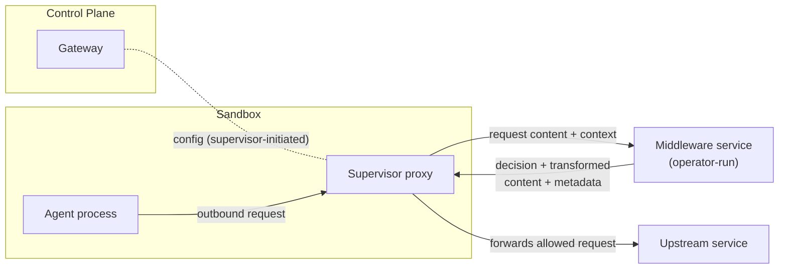
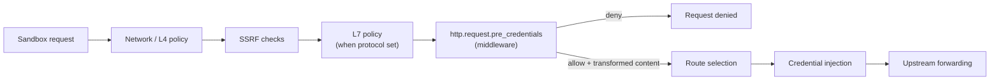

---
authors:
  - "@pimlock"
state: draft
links:
  - https://github.com/NVIDIA/OpenShell/issues/1043
  - https://github.com/NVIDIA/OpenShell/issues/1733
  - https://github.com/NVIDIA/OpenShell/issues/1734
---

# RFC 0009 - Sandbox Egress Middleware

## Summary

This RFC proposes the introduction of sandbox proxy egress middleware: a set of hooks that can inspect, transform, block, and annotate outbound sandbox requests at various steps of request processing flow. The feature described here establishes the initial support needed to validate the contract, policy integration, and operational model through early experiments; it is expected to evolve over time, and future extensions are called out throughout this RFC.

## Motivation

OpenShell already controls *where* a sandbox can connect. The supervisor enforces network policy on every outbound connection and only allows egress to approved endpoints. Today, that control stops at the destination: once a connection is allowed, the request can carry any payload. Network policy can decide whether a sandbox may talk to `api.openai.com`, but it cannot decide whether a particular request to `api.openai.com` should be allowed based on what that request contains.

Users have a need to control the content that leaves the sandbox. Agents routinely send prompts, tool arguments, uploaded files, which may contain sensitive information. Acting on that traffic, requires inspecting the request itself (e.g. redacting PII or secrets before they leave the sandbox, blocking requests that carry confidential documents, requiring sensitive content to be processed by a local model).

This RFC introduces egress middleware: hooks that run within the supervisor proxy flow and can inspect, transform, block, and annotate outbound requests based on their content. Rather than building a fixed set of content checks into OpenShell, the middleware contract lets operators process selected requests through trusted services that implement their own logic. OpenShell cannot embed every useful detection and transformation approach. We want to allow dedicated PII tools such as Presidio or NeMo Anonymizer, organization-specific classifiers, and experimental research scanners to be plugged in. A stable contract lets teams and researchers iterate on different implementations without changing OpenShell itself.

OpenShell may still ship first-party middleware for a small number of operations where it makes sense. First-party middleware uses the same request-processing model where possible, but restricted hooks may expose supervisor-only host capabilities that external middleware can never receive.

### Use-case: Privacy Guard

Privacy Guard is the motivating use case for this RFC. It is middleware that inspects outbound request content for sensitive data and applies a mitigation before the request leaves the sandbox. We use it throughout this document as a concrete example because it exercises every property the contract needs: policy-controlled placement in the proxy flow, an external service configuration, a request/response contract, failure behavior, and audit-safe findings.

Consider an agent configured with a cloud model. The operator wants uploaded images to never reach that model. With egress middleware, they configure Privacy Guard on requests bound for the model endpoint. When the agent uploads an image and asks the model about it, the middleware inspects the request content, detects the image, and redacts it - replacing it with a placeholder (for example, `image upload is disabled for this model`) before the request leaves the sandbox.

Beyond redaction, middleware also produces structured findings and string metadata about a request. That metadata is only an annotation surface in v1; the model-router work will define any routing-grade typed contract later.

## Non-goals

- **Model routing.** This RFC defines the v1 string metadata that middleware can emit, but not the component that consumes findings or metadata to pick a model. Routing a request to a different model based on findings is a separate concern tracked in [#1734](https://github.com/NVIDIA/OpenShell/issues/1734). Here we only avoid blocking a future routing contract: v1 middleware decisions stay `allow`/`deny`, and any later route-selection hook should be limited to OpenShell-managed routes rather than arbitrary rewrites from one external endpoint to another.
- **A general-purpose middleware framework.** The first version targets outbound request processing in the supervisor proxy flow. It is not an arbitrary plugin system for every extension point in OpenShell, and it does not cover response inspection or non-egress hooks. Those are possible future extensions, not part of this contract.
- **Constraining or sandboxing the middleware itself.** A middleware gets raw access to request content. OpenShell routes payloads to a service the operator chose to trust; it does not sandbox the middleware, verify its behavior, or prevent a malicious one from mishandling the data it inspects. Initially, trust is the operator's responsibility, the same way it is for sandbox images. Stronger guarantees, such as mutual authentication between the supervisor and the middleware or running the middleware in its own sandbox, will follow but are out of scope here.
- **Runtime management of middleware.** Middleware is declared in gateway configuration. A runtime CLI or API to add, list, or validate middleware - and ergonomic tooling to make registration easy, such as a dedicated command or an agent skill that scaffolds and registers a new service - is deferred to follow-up work once the contract stabilizes.
- **Guaranteeing detection correctness.** OpenShell places the hook and enforces the decision the middleware returns, but it does not guarantee that a middleware actually catches all sensitive content. Detection quality is the middleware's responsibility.
- **Support for multiple deployment modes.** The first version commits to a single deployment shape: an externally managed middleware service. Other shapes such as WASM middleware, OpenShell-managed images, sidecars, and running the middleware inside its own sandbox are not designed in this RFC. They remain explicitly open for later evaluation rather than being baked into the initial contract. See [appendices/deployment-options.md](appendices/deployment-options.md).

## Terminology

This RFC uses the following terms with specific meanings.

- **Egress.** An outbound request a sandbox sends to an upstream destination through the supervisor proxy. Middleware acts on the parsed request the supervisor has already admitted and is about to forward, not on raw packets or arbitrary network activity.
- **Middleware.** A service that inspects, transforms, blocks, or annotates egress requests through the contract defined in this RFC. A middleware owns its detection and transformation logic and never makes the upstream call itself; the supervisor always owns the upstream call.
- **Registered middleware.** A middleware an operator declares in gateway configuration as a name plus an endpoint. Registration is an administrative action that establishes which endpoints may receive raw request content; policy authors can bind middleware configs to registered middleware by name but cannot point traffic at an arbitrary endpoint.
- **Built-in middleware.** A middleware that ships inside the supervisor binary and runs in-process, with no network hop and no gateway registration. Built-in middleware names use the reserved `openshell/` namespace, for example `openshell/secrets`.
- **Hook.** A defined point in the supervisor proxy flow where the supervisor invokes a middleware. Hook names use `protocol.object.phase` ordering, so this version's single hook, `http.request.pre_credentials`, is an HTTP request hook that runs in the HTTP relay once the request is parsed and admitted by policy (network policy always, L7 policy where the endpoint declares a `protocol`) and before credential injection. The design allows more hooks later, such as `ws.message.*` or `tcp.connect.*`, without changing the v1 hook's request shape.
- **Middleware config.** A named policy entry that binds a middleware implementation (`middleware`) to service-specific configuration. The entry name is the reusable policy reference; the `middleware` value identifies the registered or built-in implementation that validates and runs the config.
- **Capabilities.** The self-description a middleware returns from `GetCapabilities`: its identity and version, the contract version it implements, and the hooks it supports. OpenShell validates that a registered middleware's capabilities support every config that binds to it.
- **Decision.** The allow-or-deny outcome a middleware returns for a request. `allow` lets the request proceed (possibly transformed); `deny` short-circuits it. This vocabulary matches the rest of the OpenShell policy system.
- **Transformation.** A middleware returning replacement content, and any allowed header mutations, that the supervisor forwards in place of the original request. A later middleware in a chain sees the previous stage's transformed content.
- **Finding.** A structured, audit-safe observation a middleware reports about a request, such as a machine-readable type, safe label, count, confidence, and optional severity. A finding never carries raw matched values, redacted spans, or the original sensitive content. The supervisor maps findings into OCSF `DetectionFinding` events.
- **Metadata.** Namespaced string key/value annotations a middleware emits into a request-local bag. V1 metadata never carries raw sensitive values. Routing-grade typed metadata, including usage markers such as audit-safe, routing-safe, or internal-only, is deferred until a component consumes it.
- **Chain.** The ordered set of middleware that applies to a single request. Each middleware runs in turn, a later stage sees the previous stage's transformed content, a `deny` short-circuits the remaining stages, and each middleware runs at most once per request.

## Proposal

The first version makes egress middleware concrete without prematurely standardizing every future deployment model. The chosen path is an externally managed middleware service: the operator runs the service, OpenShell routes selected egress through it, and the middleware returns a decision plus optional transformed content and metadata. This keeps the first iteration focused on the contract, failure behavior, and sandbox integration while leaving other deployment shapes open (see [appendices/deployment-options.md](appendices/deployment-options.md)).

The research preview does not define production authentication between the supervisor and middleware service. Unauthenticated plaintext middleware calls are allowed only as an explicit insecure mode for trusted local or isolated development environments; TLS, mTLS, invocation tokens, and middleware identity binding are deferred to a follow-up auth design. See [appendices/protocol-extensions.md](appendices/protocol-extensions.md#middleware-authentication).

### Architecture

Three components participate:

- **Gateway (control plane).** Registers middleware, validates that each registered service supports the policies that reference it, and distributes the effective middleware configuration to supervisors. The gateway never sees live request bodies; it stays off the hot path.
- **Supervisor proxy (data plane).** Calls the middleware on the request hot path, enforces the returned decision, forwards only the content the middleware returns, and carries emitted metadata forward. The supervisor owns the upstream call.
- **Middleware service.** An operator-run service, reachable from supervisors over gRPC, that inspects the request and returns a decision, optional transformed content, findings, and metadata. It owns all detection and transformation logic and never makes the upstream call itself.



### Hooks and placement

A middleware service provides hook implementations that the supervisor invokes at defined points in the proxy flow. This version defines a single hook, `http.request.pre_credentials`, and is structured so more hooks can be added later. The supervisor invokes the hook in the HTTP relay once the request has been parsed and admitted by policy, and before OpenShell injects upstream credentials.



This ordering is deliberate:

- Network policy (and L7 policy, where the endpoint declares a `protocol`) runs first, so OpenShell never sends already-denied traffic to a middleware service.
- Middleware runs before credential injection, so a middleware never receives OpenShell-managed upstream credentials.
- Route selection - choosing which upstream, and in future which model, serves the request - runs after the hook, so the later model-router work has a clear handoff point for any middleware findings or metadata it chooses to consume. There is no model router in v1; this box marks where one would plug in. Middleware does not forward traffic itself, and v1 deliberately has no `forward_to` decision. Any later route-selection hook should return an OpenShell-owned route decision for managed destinations, not an arbitrary rewrite from one external endpoint to another.
- The upstream call stays owned by the supervisor, never the middleware.

The hook operates on a parsed HTTP request, so it runs wherever OpenShell can parse one. The supervisor proxy already TLS-terminates (MITM) and HTTP-parses every egress connection that is not marked `tls: skip` and is not opaque, non-HTTP traffic, so the hook fires on those requests regardless of whether the endpoint also declares a `protocol`. Declaring a `protocol` additionally subjects the request to L7 Rego policy (`allow_request`); an endpoint without one is still terminated and parsed - today for credential injection - and the middleware hook runs on it just the same. The only traffic the hook cannot see is traffic OpenShell never parses: `tls: skip` endpoints and opaque TCP or TLS passthrough. Because OpenShell fails closed when a required middleware cannot process a request, the policy loader forbids `tls: skip` on any endpoint that attaches a middleware, so a policy cannot silently bypass a required middleware by dropping to an unparsed path.

WebSocket sits on this boundary. The upgrade request is a normal HTTP/1.1 request that the hook can inspect, allow, or deny, but the frames exchanged after the connection upgrades are out of scope for v1 (a later `message.*` hook may cover them). To keep the v1 boundary unambiguous:

**In scope for v1:**

- Inspectable HTTP/1.x requests that OpenShell terminates and parses, after L4 and SSRF admit them (and L7 policy too, where the endpoint declares a `protocol`).
- WebSocket upgrade (handshake) requests - the HTTP request that initiates the upgrade.
- Bounded request bodies: a `Content-Length` or bounded chunked body OpenShell can buffer within the size cap.
- Safe metadata output for later routing or audit.

**Out of scope for v1:**

- HTTP/2 and HTTP/3. The proxy's TLS termination pins ALPN to `http/1.1` today, so these are not introspected.
- Post-upgrade WebSocket frames, and response-body scanning.
- Opaque TCP streams and endpoints with `tls: skip`.
- Unbounded streaming uploads or full-duplex request processing.
- Multipart or compressed body semantics, unless a selected service's capabilities and policy explicitly support them within the size limits.

There is no request hook in the supervisor proxy today, so this is a net-new, synchronous, per-request call. Timeout and failure behavior are therefore load-bearing parts of the design rather than afterthoughts. In the current relay path, credential injection is interleaved with L7 forwarding - request headers and body are rewritten as the request is sent upstream - so the hook runs earlier in that path, on the admitted request and before any credential rewrite, which is what keeps OpenShell-managed credentials away from external middleware. Other hook stages such as pre-policy classification, a credential-visible `http.request.post_credentials` hook for request signing (built-in-only, for example `openshell/sigv4`), response inspection, route selection for OpenShell-managed destinations, and streaming message hooks are possible future extensions and are out of scope for v1.

### The middleware contract

The contract has two parts: a configuration-time handshake and a request-time hook. The request-time hook runs on the *hot path* - the synchronous, per-request path through the supervisor proxy, as opposed to the control-plane path used to fetch config. Middleware only sits on this path for sandboxes whose policy configures it: a sandbox with no middleware in its policy is unaffected and pays no per-request cost. Middleware is therefore an explicit opt-in, and this change is transparent to existing usage.

Configuration-time:

- `GetCapabilities` reports the service identity and version, the contract version it implements, and the hook stages it supports.
- `ValidateConfig` lets the service validate its own service-specific configuration fragment.

Request-time:

- `ProcessHttpRequestPreCredentials` carries the request plus context: request identity, endpoint and header context, optional originating process data (the binary, pid, and ancestor chain OpenShell resolves when available for network policy and audit), the bounded body, and the middleware's configuration from policy.
- The response is a decision OpenShell can apply directly: `allow` or `deny`, optional replacement content and allowed header mutations, findings (labels, counts, confidence, never raw matched values), and namespaced metadata.

A simplified sketch of the gRPC contract:

```protobuf
service ProxyMiddleware {
  // Configuration-time
  rpc GetCapabilities(CapabilitiesRequest) returns (Capabilities);
  rpc ValidateConfig(ValidateConfigRequest) returns (ValidateConfigResponse);

  // http.request.pre_credentials. Declared as a bidirectional stream so large bodies
  // can be chunked later; v1 exchanges exactly one ProcessRequest and one ProcessResponse.
  rpc ProcessHttpRequestPreCredentials(stream ProcessRequest) returns (stream ProcessResponse);
}

message Capabilities {
  string name = 1;
  string version = 2;                   // service implementation version
  string contract_version = 3;          // middleware contract major version, e.g. "v1"
  repeated string hooks = 4;            // e.g. "http.request.pre_credentials"
  repeated string metadata_namespaces = 5;
}

// Context plus body as two top-level fields, so the body is cleanly separable.
// v1 sets both in one message; a future stream sends body-only follow-ups.
message ProcessRequest {
  RequestContext context = 1;
  bytes body = 2;                       // bounded
}

message RequestContext {
  string request_id = 1;
  string sandbox_id = 2;
  Endpoint endpoint = 3;                // scheme, host, port, method, path
  map<string, string> headers = 4;      // safe subset
  google.protobuf.Struct config = 5;    // service-specific, from policy
  Process actor = 6;                    // optional originating process (per-connection)
}

// Mirrors the actor process OpenShell already resolves for network policy and OCSF audit.
message Process {
  string binary = 1;                    // resolved binary path
  uint32 pid = 2;
  repeated string ancestors = 3;        // ancestor binary paths from the process-tree walk
}

message Finding {
  string type = 1;                       // e.g. "pii.email"
  string label = 2;                      // safe display label
  uint32 count = 3;                      // number of matches, never raw values
  string confidence = 4;                 // service-defined confidence marker
  string severity = 5;                   // service-defined severity marker
}

// Outcome plus optional replacement body.
message ProcessResponse {
  Outcome outcome = 1;
  bytes body = 2;                       // replacement content when transformed
}

message Outcome {
  Decision decision = 1;                // ALLOW or DENY
  string deny_reason = 2;               // safe, machine-readable
  map<string, string> add_headers = 3;  // append-only, subject to a v1 safe-header allow-list
  map<string, string> metadata = 4;     // namespaced, no raw values
  repeated Finding findings = 5;        // labels, counts, confidence
}
```

The request and response are shaped so middleware composes cleanly in a chain. The transformed content a middleware returns (`ProcessResponse.body`) is the same request body the next middleware receives as `ProcessRequest.body`, and the allow/deny decision travels as a separate signal in `Outcome` rather than being mixed into the content. The supervisor feeds one stage's `body` (and allowed header mutations) as the input to the next stage, so a chain is effectively a fold over a single request representation; a `deny` from any stage short-circuits the rest. See [Middleware ordering](#middleware-ordering) for how chains are assembled and ordered.

Header mutation is deliberately narrow in v1. Middleware may only append safe, non-credential request headers approved by OpenShell. It cannot remove headers, rewrite existing headers, or set credential-bearing and request-routing headers such as `Authorization`, `Cookie`, `Host`, `X-Amz-*`, or OpenShell credential placeholders. This keeps request-body transformation useful while preserving the credential boundary and avoiding a second, middleware-owned routing surface.

The interface is gRPC. The hot-path RPC is declared as a bidirectional stream, but v1 exchanges exactly one `ProcessRequest` and one `ProcessResponse` over it: the supervisor buffers the bounded body and the middleware replies once. Declaring it as a stream now is deliberate, because gRPC method cardinality cannot change compatibly. It lets a later version chunk large payloads without altering the method signature. Possible extensions (chunked streaming, additional hooks, semantic context) are collected in the [protocol-extensions appendix](appendices/protocol-extensions.md), including what streaming does and does not buy. The baseline middleware ships in the supervisor and is served in-process over the same gRPC contract, with no network hop. The exact field set is settled during implementation; the sketch above is the contract shape this RFC asks reviewers to evaluate.

The `actor` process is the same identity OpenShell already resolves on the egress path - the binary, pid, and ancestor chain it uses for binary-scoped network policy and OCSF audit. It is resolved when the connection is established, so it is per-connection rather than strictly per-request: over a reused or pooled connection it identifies the process that opened the connection, which a middleware should not over-trust for per-request attribution. The field is optional because proxy-only or future shared-supervisor modes may not have reliable actor data; middleware must treat missing actor data as "unavailable" rather than as an authorization failure.

### Contract versioning

The middleware gRPC contract lives under a major-versioned protobuf package (`openshell.middleware.v1`), the same convention the compute-driver contract uses in [RFC 0001](../0001-core-architecture/README.md). Within a major version, changes stay additive and backward compatible - new fields, RPCs, hook stages, and capability fields can be added - while breaking wire or semantic changes require a new major version.

`GetCapabilities` doubles as the version handshake. A middleware reports its own implementation version and the contract major version it implements, and the supervisor only invokes a middleware whose contract major version it supports. Capability validation is mandatory: if OpenShell cannot fetch capabilities, the service reports an unsupported contract, or the policy asks for an unsupported hook or config, the gateway config load or policy update fails before traffic can depend on that middleware. Runtime validation failures are handled through `on_error` and fail closed by default. This keeps first-party and third-party middleware on one uniform contract and gives the protocol a stable path to evolve.

### Registration and delivery

The operator registers middleware in the gateway configuration: each entry is a name and an endpoint. This preserves the trust boundary. The endpoint sees raw payloads and is operator-owned infrastructure, so declaring one is an administrative action, while policy authors can only bind middleware configs to registered middleware names rather than point traffic at an arbitrary endpoint. In single-player mode one person holds both roles, but the split still holds in shared deployments.

The portable transport is gRPC over TCP/TLS, reachable from every supervisor across Docker, Podman, VM, and Kubernetes drivers (Unix sockets are not, so they are not a baseline). In local single-player deployments, a loopback endpoint such as `127.0.0.1:1234` may be translated to `host.openshell.internal` so a supervisor can reach a service running on the local host. That loopback shorthand is not an HA deployment model: Kubernetes and other shared deployments should register a routable service DNS name or address that every supervisor can reach directly.

```toml
[[openshell.proxy.middleware]]
name = "anonymizer"
grpc_endpoint = "http://127.0.0.1:1234"
allow_insecure = true   # research preview: plaintext gRPC, no auth (see appendix)

[[openshell.proxy.middleware]]
name = "agent-traces-exporter"
grpc_endpoint = "http://127.0.0.1:1235"
allow_insecure = true
```

During the research preview, a plaintext `http://` endpoint must be paired with an explicit `allow_insecure = true` on the same entry; OpenShell otherwise rejects a non-TLS endpoint rather than silently sending inspected content in the clear. This keeps the insecure choice deliberate and auditable in gateway configuration while production auth is deferred (see [appendices/protocol-extensions.md](appendices/protocol-extensions.md#middleware-authentication)).

The external-service endpoint is trusted operator infrastructure in v1. A follow-up auth design should make both directions explicit: the supervisor proves to the middleware that the call is authorized for the specific middleware identity, and the supervisor verifies it is calling the intended middleware service. Candidate mechanisms include TLS trust configuration, optional mTLS, and gateway-minted invocation tokens scoped to one middleware.

Middleware implementation names may be bare (`anonymizer`) or namespaced with `/` (`nvidia/anonymizer`, `acme/security/pii-redactor`). Empty path segments are invalid, so `/foo`, `foo/`, and `foo//bar` are rejected. The `openshell/` namespace is reserved for built-in OpenShell middleware, such as `openshell/secrets` or `openshell/sigv4`. The configured policy `name` remains the local registration or config name that policies reference.

Built-in middleware ships in the supervisor binary and needs no registration.

Supervisors receive the effective configuration over the same authenticated control-plane gRPC channel they already use for policy, provider, and inference config. The exact delivery shape is deferred to implementation: it can extend the existing sandbox config response (`GetSandboxConfig` / `SandboxPolicy`) or use a dedicated bundle RPC in the style of `GetInferenceBundle`. Because the registered endpoint is reachable from both the gateway and the supervisors in the external-service deployment mode, capability validation runs at the gateway (at config load and when a policy config binds to a middleware) and again at the supervisor before traffic flows; a validation failure fails the load rather than silently disabling the middleware. A future sidecar mode would shift validation entirely to the supervisor.

Middleware registration lives in gateway configuration, which is not hot-reloaded ([RFC 0003](../0003-gateway-configuration/README.md) lists this as a non-goal): changing the registered set requires restarting the gateway. On restart, supervisors re-sync the effective configuration over their existing connection, so running sandboxes pick up a newly added middleware rather than only newly created sandboxes seeing it - there is no per-sandbox snapshot of the registered set.

Removing a registered middleware that an active policy config still binds to will cause those sandboxes to fail: requests that require the removed middleware can no longer be processed, so `on_error` (fail-closed by default) denies them. For now, the operator is responsible for removing the policy configs before removing the registration. A registered middleware that becomes unavailable at runtime (its process is down, or the network is partitioned) is handled the same way, by `on_error`.

V1 does not define proactive middleware health checks. The supervisor discovers runtime unavailability when it invokes the middleware and applies the configured timeout plus `on_error` behavior. A later health check could improve availability by failing fast or alerting before the next request, but it is an optimization rather than a correctness requirement for the initial contract.

Multitenancy is handled by OpenShell policy selection, not by giving middleware its own tenant-routing model. A shared middleware service may receive requests from many sandboxes, but the service should treat `sandbox_id`, policy name, and endpoint context as audit context only unless a later OpenShell domain object defines stronger grouping semantics. Middleware-specific tenant grouping is possible but not part of the OpenShell contract.

### Policy integration

Policy decides which middleware runs for which traffic, how it is configured, and what happens on failure. To avoid duplicating the same rules across many endpoints, middleware configs are described once in a reusable layer that network policies or individual endpoints then reference by name, rather than being repeated inline on every endpoint.

A middleware config has two identifying fields. `name` is the policy-local config that policies and endpoints reference, while `middleware` identifies the implementation to run: either a registered middleware name from gateway configuration or a built-in name reserved for OpenShell. This lets one implementation have multiple configs, such as `sigv4-bedrock` and `sigv4-s3` both using `openshell/sigv4` with different signing settings.

Each entry supplies its service-specific configuration, sets failure behavior (`on_error`, fail-closed by default when processing is required), and may select endpoints it applies to globally. OpenShell does not interpret the configuration; it passes the fragment to the middleware implementation and relies on `ValidateConfig` to check it.

Network policies and individual endpoints attach one or more middleware configs as an ordered chain. A policy-level `middleware: [...]` list applies to every endpoint in that policy. An endpoint-level `middleware: [...]` list applies only to that endpoint. If both are present, the policy-level list runs first and the endpoint-level list appends any additional entries. V1 does not add a separate numeric `order` field; order is expressed by list position in the policy shape that attaches the middleware. Each config runs in turn, a later stage sees the previous stage's transformed content, a `deny` short-circuits the chain, and metadata accumulates in namespaced buckets. Policy validation combines OpenShell structural checks (the referenced config exists, its implementation exists, the hook is supported, limits are in bounds, selectors are well-formed) with the service's own `ValidateConfig`. If validation fails, sandbox creation or policy update fails before any traffic reaches the hook. Middleware layers on top of the existing policy evaluation rather than replacing it: network and L7 decisions are made as they are today, and middleware runs only on requests that evaluation has already admitted.

Implementation-wise, the hook is a new supervisor-side Rust enforcement stage selected by policy data, not a Rego rule. Existing Rego evaluation remains the metadata gate: L4 policy admits the connection and, where the endpoint declares a `protocol`, L7 policy admits the parsed request; the supervisor then buffers the bounded body, calls the configured middleware chain, and applies the returned decision or transformation. The hook does not depend on L7 Rego running - on a parsed request to an endpoint with no `protocol`, the chain still runs after L4 admits the connection. Request bodies do not become Rego input in v1. A later design may add a declarative pass over middleware findings, but v1 applies middleware outcomes directly.

```yaml
network_middlewares:
  # Built-in secret redaction shipped in the supervisor; no gateway registration needed.
  - name: redact-secrets
    middleware: openshell/secrets
    config:
      secrets: redact
    on_error: deny
    endpoints:
      include: ["*.github.com"]
      exclude: ["graphql.github.com"]

  - name: anonymize        # policy-local config
    middleware: anonymizer  # matches the gateway config entry
    config:
      pii: redact           # validated by the middleware via ValidateConfig
    on_error: deny
    endpoints:
      include: ["*"]        # applies to every request

  - name: export-traces
    middleware: agent-traces-exporter
    config:
      exclude_images: true
    on_error: allow

  - name: sigv4-bedrock
    middleware: openshell/sigv4
    config:
      signing_service: bedrock
    on_error: deny

  - name: sigv4-s3
    middleware: openshell/sigv4
    config:
      signing_service: s3
    on_error: deny

network_policies:
  github_api:
    # no middleware list: redact-secrets and anonymize both apply through their global selectors
    endpoints:
      - host: api.github.com
        port: 443
        protocol: rest
        access: read-only

  nv_inference:
    # anonymize is global, but listing it here fixes its order before export-traces
    middleware: [anonymize, export-traces]
    endpoints:
      - host: inference-api.nvidia.com
        port: 443
        protocol: rest

  aws:
    endpoints:
      - host: bedrock-runtime.us-east-1.amazonaws.com
        port: 443
        protocol: rest
        middleware: [sigv4-bedrock]
      - host: s3.us-east-1.amazonaws.com
        port: 443
        protocol: rest
        middleware: [sigv4-s3]
```

With this policy, `anonymize` applies to every request through its global endpoint selector. Requests to `api.github.com` have secrets redacted and are then anonymized (both run via their global selectors, in `network_middlewares` order). Requests to `inference-api.nvidia.com` are anonymized and then exported to the trace collector: `anonymize` is global, but listing it explicitly in the policy fixes its order ahead of `export-traces`. The AWS endpoints demonstrate endpoint-level attachment: both `sigv4-bedrock` and `sigv4-s3` use the same built-in implementation, but they are separate configs and only apply to their named endpoints. If `anonymize` times out or errors the request is denied; if `export-traces` fails the request is allowed through.

V1 middleware configs are policy-local and are not embedded in provider profiles. Provider-supplied network policies can still be targeted by attaching middleware at the policy or endpoint level after the effective policy is assembled. Reusable cross-sandbox middleware profiles, and provider-profile fields that opt into built-in middleware such as `openshell/sigv4`, are deferred until the implementation proves the policy-local shape.

### Middleware ordering

When more than one middleware applies to a request, the order is well-defined:

- Middleware configs are defined once in a top-level `network_middlewares` list and attached to traffic from network policies or individual endpoints through an explicit `middleware: [...]` list. Policy-level lists apply to all endpoints in the policy; endpoint-level lists apply only to that endpoint and append after the policy-level list. These lists determine the relative order of the configs they name.
- A config can also include itself globally through its own endpoint selector (for example `include: ["*"]`), independent of any policy or endpoint attachment. Globally-included configs that are not also named in an explicit list run *before* the explicit list, in the order they appear in `network_middlewares`.
- A config runs at most once per request. If the same config is both globally included and named in a policy or endpoint list (or listed more than once), it executes a single time, at the position given by the first explicit list occurrence. Different configs may point at the same middleware implementation and still remain distinct.

For example, if `redact-secrets` includes `*.github.com` globally and the policy for `api.github.com` attaches `middleware: [anonymize]`, a request to `api.github.com` runs `redact-secrets` first (global), then `anonymize` (policy list).

Alternatives considered:

- A numeric `order` or `priority` field on each middleware config. Rejected for v1 because it spreads ordering across distant entries, creates collision and tie-break semantics, and makes common local edits harder to review than an ordered list.
- `before` / `after` constraints between named middleware configs. Deferred until reusable middleware profiles, provider-profile middleware, or cross-policy composition creates a real need for partial ordering.
- Implementation-defined ordering. Rejected because middleware can transform request content, so operators need deterministic and reviewable ordering.

### Metadata and downstream routing

Beyond allow/deny and transformation, middleware emits string metadata (for example `modalities = "text,image"`, `sensitivity = "restricted"`, `requires_local_model = "true"`) into a request-local metadata bag. The supervisor stores that metadata under the middleware config's local name, so `anonymize.sensitivity` and `budget.sensitivity` do not collide even if two services return the same key. V1 metadata is intentionally string-only and never carries raw sensitive values. This gives early middleware a safe annotation surface while deferring routing-grade typed metadata and usage markings to the model-router work; the router itself is out of scope ([#1734](https://github.com/NVIDIA/OpenShell/issues/1734)).

Because `http.request.pre_credentials` runs before route selection and credential injection, v1 does not guarantee that metadata visible at this hook includes the final routed model or upstream route. Budget-style middleware that needs post-call status, final route/model, content length, or token usage needs a later metadata-only notification hook such as `http.response.completed`; that hook is listed as a future extension in the [protocol-extensions appendix](appendices/protocol-extensions.md#additional-hooks), not part of the v1 request hook.

The namespace is the policy-local middleware config name, not the implementation name. This means two configs that use the same implementation still produce separate metadata buckets, and changing the registered service behind a config does not rename downstream annotations.

### Audit and logging

A middleware decision is observable sandbox behavior, so it is recorded as an OCSF event, consistent with how the supervisor already logs network and L7 enforcement. This RFC commits to the event categories and the safety rules; exact field mappings are an implementation detail.

- **Per-request decisions** are `HttpActivity` events, since the middleware is an L7 enforcement point. Each invocation records the middleware name, the decision (`allow` or `deny`), whether content was transformed, latency, and the policy and endpoint context. Allowed requests are `Informational`; denials are `Medium`.
- **Failures that block traffic** dual-emit: the denial above plus a `DetectionFinding`, so operators can alert when a required middleware is unavailable, times out, returns a malformed response, or fails a capability check. The finding is `High`.
- **Configuration events** are `ConfigStateChange` events: middleware registration loaded, capability validation result, and policy validation outcome. A validation failure that fails the config load is recorded here.

These events must never leak the content they describe. The OCSF JSONL may be shipped to external systems, so:

- Raw request content, matched values, redacted spans, and service-config secrets are never logged.
- Events carry only safe summaries: middleware and policy names, decision, latency, finding labels and counts, and failure reason.

This mirrors the middleware response contract, which already forbids the service from returning raw matched values.

## Implementation plan

Egress middleware stays opt-in throughout: until a policy attaches a middleware config, no sandbox calls one and the proxy hot path is unchanged. It ships in two phases, the first proving the entire contract in-process before any networking, registration, or auth exists.

**Phase 1 - in-process middleware.** Define the `Middleware` gRPC contract (`GetCapabilities`, `ValidateConfig`, `ProcessHttpRequestPreCredentials`), implement its server side in the supervisor, and ship one built-in middleware with the reserved `openshell/` namespace (for example `openshell/secrets`). The supervisor invokes the `http.request.pre_credentials` hook in the L7 relay's per-request path - after policy admits the request and before credential injection - buffering the bounded body, enforcing the decision, applying transformation, running a chain in order, applying `on_error`, and accumulating metadata. Policy gains the top-level `network_middlewares` config list plus policy-level and endpoint-level `middleware: [...]` attachments, and decisions are recorded as the OCSF events described above. This exercises the whole contract, policy integration, and hot-path enforcement end to end with no external dependencies.

**Phase 2 - external middleware service.** Open the same contract to operator-run services. The gateway gains the `[openshell.proxy]` configuration table (name, gRPC endpoint, `allow_insecure`), runs capability validation at config load and on policy reference, and delivers the effective middleware configuration to supervisors over the existing authenticated control-plane gRPC channel, where it is re-validated before traffic flows. This phase adds the registration trust boundary, the insecure research-preview mode, and the deployment guidance in [appendices/deployment-options.md](appendices/deployment-options.md) - none of which Phase 1 requires.

### Backwards compatibility and migration

There is nothing to migrate. The feature is additive and opt-in: a sandbox whose policy declares no middleware behaves exactly as it does today and pays no per-request cost, and existing policy and gateway config files stay valid because every new field is optional. The one shared surface is request-body buffering - middleware that needs the full body reuses and may extend the proxy's existing bounded buffering boundary, so its limit must be reconciled with the current cap rather than introducing a second, conflicting one. This interaction is covered under Risks.

### Research preview

The first release is a research preview. The contract, policy surface, and scope are provisional and may change without the usual compatibility guarantees, and production authentication between the supervisor and external middleware is deferred (see [appendices/protocol-extensions.md](appendices/protocol-extensions.md#middleware-authentication)). The goal of the initial implementation is to validate the contract and operational model through early experiments - a built-in middleware plus a small number of trusted external services - before committing to long-term stability.

## Risks

Adding a synchronous, content-aware hook to the egress path has real costs. The most significant:

- **Hot-path latency and a new per-request dependency.** There is no request hook in the proxy today. Each applicable request now makes a synchronous call to a middleware and blocks on its reply, so middleware latency becomes request latency and the middleware becomes a new failure surface on the data plane. This is bounded by opt-in (only sandboxes whose policy attaches middleware pay any cost), by per-middleware timeouts, and by built-in middleware running in-process with no network hop, but for those sandboxes the tax is unavoidable.
- **Fail-closed breaks workloads.** Denying traffic when a required middleware is unavailable, times out, or returns a malformed response is the safe default, but it converts a middleware outage into a sandbox outage. The opposite default leaks the very content the middleware exists to control. There is no choice that is both safe and always available; `on_error` makes the tradeoff explicit per middleware, but operators can still pick a default that surprises them.
- **Body buffering and size limits.** Inspecting content means buffering a bounded request body instead of streaming it, which adds memory cost and interacts badly with growing payloads (for example inference requests whose context expands each turn until it exceeds the cap). An over-cap request is treated as an `on_error` event for the middleware that needs the body, so it follows the same fail-closed default: it is denied unless the operator has explicitly set `on_error: allow` for that middleware. Passing an over-cap request through unprocessed is therefore never the default - it is an opt-in choice made per middleware, and one a security-critical middleware would deliberately leave off so that oversized content is denied rather than silently egressed.
- **No OpenShell-side rate limiting.** OpenShell does not throttle calls to a middleware. A middleware that is slow, overloaded, or unavailable is handled only by its timeout and `on_error`, so operators must size, scale, and protect the service themselves; a struggling middleware degrades every request routed through it.
- **Trusting an unsandboxed service with raw content.** Middleware receives raw request payloads, and OpenShell does not sandbox it, verify its behavior, or prevent it from mishandling or exfiltrating what it inspects. A buggy or malicious middleware is a direct data-exposure path. Trust in the middleware is the operator's responsibility, the same as trust in a sandbox image, but the blast radius here is in-flight request content.
- **A false sense of coverage.** The hook runs only on traffic OpenShell terminates and parses; `tls: skip` endpoints, opaque TCP or TLS passthrough, encrypted or otherwise opaque bodies, and content the middleware simply fails to detect all flow through without effective inspection. An operator who assumes "middleware is attached, therefore content is checked" can be wrong. For example, an operator attaches a content-inspection middleware to their cloud model endpoint and assumes uploads to it are now safe; meanwhile the agent egresses the same file by POSTing it to a different allowed endpoint that has no middleware attached, or by sending it through a `tls: skip` endpoint that is never parsed, or by embedding it in a body format the middleware does not parse - all reach the network without ever passing through the hook. The design mitigates the bypass-by-unparsed-path gap by forbidding `tls: skip` on middleware-attached endpoints, but detection correctness, content sent to other endpoints, and opaque payloads remain inherent limitations, not bugs.
- **No transport authentication in the research preview.** Production auth between the supervisor and an external middleware is deferred, and the insecure mode allows plaintext gRPC. Because a middleware can allow, deny, or transform egress, an impersonated or eavesdropped middleware is a policy-enforcement bypass, not just an observability gap. The insecure mode is gated behind an explicit `allow_insecure` opt-in and is unsuitable for shared or untrusted networks; full auth is tracked as follow-up work. See [appendices/protocol-extensions.md](appendices/protocol-extensions.md#middleware-authentication).
- **Added surface to build, version, and maintain.** A new gRPC contract, policy schema, gateway configuration table, and capability handshake are all long-lived surfaces with compatibility obligations, and middleware chains add ordering semantics operators must reason about. The research-preview framing keeps the contract provisional for now, but the long-term maintenance cost is real and is the main argument for keeping v1 deliberately small.

The cost of *not* doing this is leaving content-level egress control entirely outside OpenShell: operators who need to redact, block, or annotate outbound content based on what it contains would have to build bespoke proxies around the sandbox, losing the policy integration, audit, and trust boundary the supervisor already provides.

## Alternatives

- **Build content checks into OpenShell directly.** A fixed, built-in set of DLP/redaction rules avoids a contract and an external service. Rejected as the primary model: OpenShell cannot embed every useful detection and transformation approach, and a stable contract lets dedicated tools and research scanners iterate without changing OpenShell. First-party built-in middleware still ships for narrow cases, over the same contract.
- **REST instead of gRPC.** A REST/JSON hook is simpler to call, and with OpenAPI it could still offer a capability handshake and a typed contract. Rejected because gRPC's typing is stronger and its streaming story is cleaner: the hot-path RPC is already declared as a stream so large bodies can be chunked later without a breaking signature change, which is awkward to match over REST. OpenShell already uses gRPC across its service contracts, so staying on a single toolchain avoids a second RPC stack to build, secure, and maintain.
- **Other deployment modes (WASM, sidecar, in-sandbox).** In-process WASM filters or sidecars avoid a network hop and can tighten the trust boundary. Deferred rather than rejected: v1 commits to a single external-service shape to keep the contract small, and other shapes remain open. See [appendices/deployment-options.md](appendices/deployment-options.md).
- **Doing nothing.** The cost of declining is covered at the end of Risks: content-level egress control stays outside OpenShell, and operators must build bespoke proxies that lose the policy integration, audit, and trust boundary the supervisor already provides.

## Prior art

Calling an external service from a proxy to inspect, transform, or block in-flight traffic is well-established. The closest analogs:

- **Envoy `ext_proc` (External Processing).** The primary model for this RFC. Envoy streams request headers and body to an external gRPC service that can mutate the body (for example redaction), allow, or deny, and the proxy and the processing service scale independently. Our `http.request.pre_credentials` hook is effectively a buffered, single-hook v1 of the same boundary, with the proto shaped to grow toward `ext_proc`-style streaming later.
- **Envoy `ext_authz` (External Authorization).** A narrower sibling: an external service returns an allow/deny decision per request. It validates the "delegate the per-request decision to an external service in the hot path" pattern, without the content-transformation half that this RFC needs.
- **ICAP (RFC 3507).** HTTP proxies offload content adaptation, virus scanning, DLP, and content filtering to external ICAP servers that can modify or block request/response content. It is the closest *functional* precedent for content-aware egress control. Two details map directly onto our design: ICAP supports **pipelining** multiple servers (our middleware chain) and a **content preview** of the first bytes before full processing (our bounded-body buffering). What we avoid is its dated, text-based wire protocol; gRPC gives us typed contracts and a path to streaming.
- **HashiCorp `go-plugin` (Terraform, Vault).** Third-party plugins run as separate processes and communicate with the core exclusively over gRPC. It shows a strictly typed gRPC contract is a robust way to manage cross-language third-party extensions, which informs our registration plus capability handshake (`GetCapabilities`, `ValidateConfig`).
- **Kubernetes CSI / KMS.** Vendor-specific integrations are offloaded to external gRPC services rather than compiled into the core. Same "core defines the contract; integrators implement it out-of-process" split we use for middleware.
- **Proxy-Wasm (Envoy/Istio Wasm filters).** In-process WebAssembly extensions with strong default-deny sandboxing and no IPC latency. Relevant to the future WASM deployment mode (see the deployment-options appendix); set aside for v1 because it is currently weak for GPU-backed or memory-heavy semantic guards.

## Decisions and explicit deferrals

This section closes the current review themes.

### Decisions

- **Middleware naming.** Keep the feature name "sandbox egress middleware." The service can inspect, transform, deny, and annotate, so narrower names such as "transformer" or "request processor" describe only part of the contract.
- **Middleware implementation names.** Use `/` for implementation namespaces. `openshell/` is reserved for built-in middleware. Bare names and third-party namespaces are valid; empty path segments are invalid.
- **Hook naming.** Keep `protocol.object.phase` names such as `http.request.pre_credentials`. The prefix describes the payload shape, and the phase describes the proxy position. Later protocols can add names such as `ws.message.*` or `tcp.connect.*` without renaming the v1 hook.
- **HTTP scope of v1.** `http.request.pre_credentials` applies to every HTTP/1.x request that OpenShell terminates and parses, whether or not the endpoint declares a `protocol`. WebSocket upgrade requests are included; post-upgrade frames, HTTP/2, HTTP/3, opaque TCP, and `tls: skip` traffic are excluded.
- **Route selection and forwarding.** V1 has no `forward_to` decision. Middleware never makes the upstream call. Future route-selection hooks may choose among OpenShell-managed destinations, such as model routes, but must not become arbitrary external endpoint rewrites.
- **SigV4/request signing.** AWS SigV4 belongs to a restricted built-in `http.request.post_credentials` hook, not external `http.request.pre_credentials` middleware. The middleware can be configured by policy, but it must run in-process with supervisor host capabilities so it can strip placeholder signatures and sign with real supervisor-resolved credentials without exposing those credentials over the external middleware contract.
- **Composability and ordering.** Middleware is chainable and ordered by policy list position, not a separate numeric `order` field. A stage receives the previous stage's transformed body and allowed header mutations; `deny` short-circuits the chain; each config runs at most once per request.
- **Header mutation.** External v1 middleware can only append safe headers from an OpenShell allow-list. It cannot remove or rewrite existing headers, credential-bearing headers, request-routing headers, AWS SigV4 headers, or OpenShell credential placeholders.
- **Finding shape.** Findings are audit-safe summaries: type, label, count, confidence, optional severity, and future namespaced attributes. They never include matched values or raw content. The supervisor maps them into OCSF `DetectionFinding` events.
- **Actor data.** Actor process data is optional and per-connection. Middleware must treat it as context, not a reliable per-request identity or authorization input.
- **Metadata namespacing.** Metadata is stored under the policy-local middleware config name. This prevents collisions without a central key registry and lets two configs using the same implementation emit independent metadata.
- **Endpoint selectors plus explicit attachment.** Keep both surfaces. A config-level `endpoints:` selector is a global include/exclude rule. Policy-level and endpoint-level `middleware: [...]` lists explicitly attach middleware and fix ordering. If both apply, the config runs once at the first explicit-list position; otherwise global matches run before explicit lists in `network_middlewares` order.
- **Failure behavior.** Middleware errors, timeouts, malformed responses, and over-cap bodies use `on_error`; `deny` is the fail-closed default. Passing unprocessed content through is only possible when the operator explicitly sets `on_error: allow`.
- **Chunked and compressed bodies.** V1 operates on bounded bytes OpenShell can buffer safely. The size cap applies to the buffered wire representation; compressed bodies are opaque unless a middleware explicitly advertises and validates support for handling them; slow chunked uploads are bounded by the same cap and request timeout. Rich decoded-body semantics are deferred.
- **Trust boundary.** External middleware endpoints are trusted operator infrastructure in v1. Plaintext/insecure mode must be explicit with `allow_insecure = true`; production auth is not hidden as an implementation detail.
- **Multitenancy.** OpenShell controls middleware application through policy selection. A middleware may receive sandbox and policy context for audit, but OpenShell does not define a middleware-owned tenant grouping model in v1.
- **API maturity qualifier.** Use `openshell.middleware.v1`, not `v1alpha1`. The project is already alpha-stage; the RFC labels this contract as a research preview, so an additional per-contract alpha package adds little.

### Explicit deferrals

- **Provider-profile middleware.** V1 middleware configs live in sandbox policy, not provider profiles. Provider-supplied network policies can be targeted after effective policy assembly. Provider-profile opt-ins for built-in middleware such as `openshell/sigv4`, and reusable cross-sandbox middleware profiles, are follow-up design work.
- **Config delivery path.** The implementation may extend the existing sandbox config response or add a dedicated bundle RPC. This is an internal delivery choice, not part of the middleware service contract, and can be decided in the implementation PR.
- **Health checks.** V1 relies on per-request invocation, timeout, and `on_error`. Proactive health checks can improve alerting and fail-fast behavior later, but they are not required for correctness.
- **Registration ergonomics and ownership.** V1 middleware registration is an operator concern: middleware services are declared in gateway configuration and changing the registered set requires a gateway restart. Runtime user-managed registration, CLI/API helpers, SDK helpers, and an agent skill for scaffolding or registering middleware are useful follow-ups after the policy and service contract stabilize.
- **Post-call budget reconciliation.** Budget-style middleware that needs final route/model, status, content length, or token usage needs a metadata-only hook such as `http.response.completed`. That hook is listed as a future extension and is not part of the v1 request hook.
- **Deployment modes and timelines.** V1 commits to externally managed services plus in-process built-ins. WASM, sidecar, OpenShell-managed image, and in-sandbox middleware have no committed timeline in this RFC.
